# PyTorch Scholarship Challenge 2018/2019 Notes


<p align="center">
  
</p>

A collection of notes on PyTorch Scholarship Challenge 2018/2019.

Contributions are always welcome!

<!-- toc -->

- [AMA](#ama)
- [Lesson 2: Introduction to Neural Network](#lesson-2-introduction-to-neural-network)
  * [Lectures](#lectures)
    + [Classification Problems](#classification-problems)
    + [Decision Boundary](#decision-boundary)
    + [Perceptrons](#perceptrons)
    + [Why "Neural Networks"?](#why-neural-networks)
    + [Perceptrons as Logical Operators](#perceptrons-as-logical-operators)
    + [Perceptron Trick](#perceptron-trick)
    + [Perceptron Algorithm](#perceptron-algorithm)
    + [Non-Linear Regions](#non-linear-regions)
    + [Error Functions](#error-functions)
    + [Log-loss Error Function](#log-loss-error-function)
    + [Discrete vs Continous](#discrete-vs-continous)
    + [Softmax](#softmax)
    + [One-Hot Encoding](#one-hot-encoding)
    + [Maximum Likelihood](#maximum-likelihood)
    + [Cross-Entropy](#cross-entropy)
    + [Multi-Class Cross Entropy](#multi-class-cross-entropy)
    + [Logistic Regression](#logistic-regression)
    + [Gradient Descent](#gradient-descent)
    + [Feedforward](#feedforward)
    + [Backpropagation](#backpropagation)
    + [Overfitting & Underfitting](#overfitting--underfitting)
      - [Overfitting](#overfitting)
      - [Underfitting](#underfitting)
    + [Early Stopping](#early-stopping)
    + [Regularization](#regularization)
    + [Dropout](#dropout)
    + [Local Minima](#local-minima)
    + [Random Restart](#random-restart)
    + [Momentum](#momentum)
  * [Quizes](#quizes)
  * [Notebooks](#notebooks)
- [Lesson 3: Talking PyTorch with Soumith Chintala](#lesson-3-talking-pytorch-with-soumith-chintala)
  * [Interview](#interview)
    + [Origins of PyTorch](#origins-of-pytorch)
    + [Debugging and Designing PyTorch](#debugging-and-designing-pytorch)
    + [From Research to Production](#from-research-to-production)
    + [Hybrid Frontend](#hybrid-frontend)
    + [Cutting-edge Applications in PyTorch](#cutting-edge-applications-in-pytorch)
    + [User Needs and Adding Features](#user-needs-and-adding-features)
    + [PyTorch and the Facebook Product](#pytorch-and-the-facebook-product)
    + [The Future of PyTorch](#the-future-of-pytorch)
    + [Learning More in AI](#learning-more-in-ai)
- [Lesson 4: Introduction to PyTorch](#lesson-4-introduction-to-pytorch)
  * [Lectures](#lectures-1)
    + [Single layer neural networks](#single-layer-neural-networks)
    + [Networks Using Matrix Multiplication](#networks-using-matrix-multiplication)
    + [Neural Networks in PyTorch](#neural-networks-in-pytorch)
    + [Network Architectures in PyTorch](#network-architectures-in-pytorch)
    + [Classifying Fashion-MNIST](#classifying-fashion-mnist)
    + [Inference and Validation](#inference-and-validation)
    + [Saving and Loading Models](#saving-and-loading-models)
    + [Loading Image Data](#loading-image-data)
    + [Transfer Learning](#transfer-learning)
    + [Tips, Tricks, and Other Notes](#tips-tricks-and-other-notes)
  * [Notebooks](#notebooks-1)
  * [Tips & Trick](#tips--trick)
    + [Things to run torch Training with GPU in colab](#things-to-run-torch-training-with-gpu-in-colab)
- [Lesson 5 : Convolutional Neural Networks](#lesson-5--convolutional-neural-networks)
  * [Lectures](#lectures-2)
    + [Applications of CNNs](#applications-of-cnns)
    + [Lesson Outline](#lesson-outline)
    + [MNIST Dataset](#mnist-dataset)
    + [How Computers Interpret Images](#how-computers-interpret-images)
    + [MLP (Multi Layer Perceptron) Structure & Class Scores](#mlp-multi-layer-perceptron-structure--class-scores)
    + [Do Your Research](#do-your-research)
    + [Loss & Optimization](#loss--optimization)
    + [Defining a Network in PyTorch](#defining-a-network-in-pytorch)
    + [Training the Network](#training-the-network)
    + [One Solution](#one-solution)
    + [Model Validation](#model-validation)
    + [Validation Loss](#validation-loss)
    + [Image Classification Steps](#image-classification-steps)
    + [MLPs vs CNNs](#mlps-vs-cnns)
    + [Local Connectivity](#local-connectivity)
    + [Filters and the Convolutional Layer](#filters-and-the-convolutional-layer)
    + [Filters & Edges](#filters--edges)
    + [Frequency in Images](#frequency-in-images)
    + [High-pass Filters](#high-pass-filters)
    + [OpenCV & Creating Custom Filters](#opencv--creating-custom-filters)
    + [Convolutional Layer](#convolutional-layer)
    + [Convolutional Layers (Part 2)](#convolutional-layers-part-2)
    + [Stride and Padding](#stride-and-padding)
    + [Pooling Layers](#pooling-layers)
    + [Increasing Depth](#increasing-depth)
    + [CNNs for Image Classification](#cnns-for-image-classification)
    + [Convolutional Layers in PyTorch](#convolutional-layers-in-pytorch)
    + [Feature Vector](#feature-vector)
    + [CIFAR Classification Example](#cifar-classification-example)
    + [Image Augmentation](#image-augmentation)
    + [Groundbreaking CNN Architectures](#groundbreaking-cnn-architectures)
    + [Visualizing CNNs (Part 1)](#visualizing-cnns-part-1)
    + [Visualizing CNNs (Part 2)](#visualizing-cnns-part-2)
    + [Summary of CNNs](#summary-of-cnns)
  * [Quizes](#quizes-1)
    + [Q1 - 5.5: How Computers Interpret Images](#q1---55-how-computers-interpret-images)
    + [Q2 - 5.6: MLP Structure & Class Scores](#q2---56-mlp-structure--class-scores)
    + [Q3 - 5.24: Kernels](#q3---524-kernels)
    + [Q4 - 5.32: CNN's for Image Classification](#q4---532-cnns-for-image-classification)
    + [Q5 - 5.33: Convolutional Layers in PyTorch](#q5---533-convolutional-layers-in-pytorch)
  * [Notebooks](#notebooks-2)
- [Lesson 6: Style Transfer](#lesson-6-style-transfer)
  * [Lectures](#lectures-3)
    + [Style Transfer](#style-transfer)
    + [Separating Style & Content](#separating-style--content)
    + [VGG19 & Content Loss](#vgg19--content-loss)
    + [Gram Matrix](#gram-matrix)
    + [Style Loss](#style-loss)
    + [Loss Weights](#loss-weights)
  * [Quizes](#quizes-2)
    + [Q1 - 6.4: Gram Matrix](#q1---64-gram-matrix)
      - [Q 1.1](#q-11)
      - [Q 1.2](#q-12)
  * [Notebooks](#notebooks-3)
- [Lesson 7: Recurrent Neural Networks](#lesson-7-recurrent-neural-networks)
  * [Lectures](#lectures-4)
    + [Intro to RNNs](#intro-to-rnns)
    + [RNN vs LSTM](#rnn-vs-lstm)
    + [Basics of LSTM](#basics-of-lstm)
    + [Architecture of LSTM](#architecture-of-lstm)
    + [The Learn Gate](#the-learn-gate)
    + [The Forget Gate](#the-forget-gate)
    + [The Remember Gate](#the-remember-gate)
    + [The Use Gate](#the-use-gate)
    + [Putting it All Together](#putting-it-all-together)
    + [Other architectures](#other-architectures)
    + [Implementing RNNs](#implementing-rnns)
    + [Time-Series Prediction](#time-series-prediction)
    + [Training & Memory](#training--memory)
    + [Character-wise RNNs](#character-wise-rnns)
    + [Sequence Batching](#sequence-batching)
    + [Notebook: Character-Level RNN](#notebook-character-level-rnn)
    + [Implementing a Char-RNN](#implementing-a-char-rnn)
    + [Batching Data, Solution](#batching-data-solution)
    + [Defining the Model](#defining-the-model)
    + [Char-RNN, Solution](#char-rnn-solution)
    + [Making Predictions](#making-predictions)
  * [Quizes](#quizes-3)
  * [Notebooks](#notebooks-4)
- [Lesson 8](#lesson-8)
- [Lesson 9](#lesson-9)
- [Challenge Project](#challenge-project)
- [Credits](#credits)

<!-- tocstop -->

## AMA

* [2018-11-09 A](https://drive.google.com/open?id=1eqQ2auQ4ClI_v1Rqm--cI2Vm5Ew5-F1x)
* [2018-11-09 B](https://drive.google.com/open?id=1er8e0DRRP61ugEysRPBLRRw_0E2kNwQA)
* [2018-11-13](https://drive.google.com/open?id=13cp-IkrGet6mb6dzi55bBTLAWuP6S4zw)
* [2018-11-14](https://drive.google.com/open?id=1fGZe2yHuq3_hAdK4ZhodfyoNk5ofZq_j)
* [2018-11-15 A](https://drive.google.com/open?id=1x-QXNcVXKu-VokKvRlX9NreT9atQTyHK)
* [2018-11-15 B](https://drive.google.com/open?id=1mstM3SvvhIIwcBbtClzXaLx37Z9oHozX)

## Lesson 2: Introduction to Neural Network
### Lectures
#### Classification Problems
  The problem of identifying to which of a set of categories (sub-populations) a new observation belongs.

  <p align="center">
    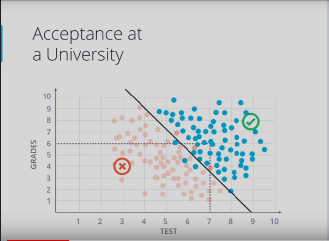
  </p>

#### Decision Boundary
  The separator between classes learned by a model in a binary class or multi-class classification problems. For example, in the following image representing a binary classification problem, the decision boundary is the frontier between the blue class and the red class:

  * Linear Boundaries
    <p align="center">
      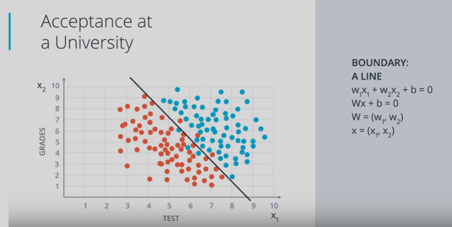
    </p>

  * Higher Dimensions
    <p align="center">
      
    </p>

#### Perceptrons
  A system (either hardware or software) that takes in one or more input values, runs a function on the weighted sum of the inputs, and computes a single output value. In machine learning, the function is typically nonlinear, such as ReLU, sigmoid, or tanh.

  In the following illustration, the perceptron takes n inputs, each of which is itself modified by a weight before entering the perceptron:

  <p align="center">
    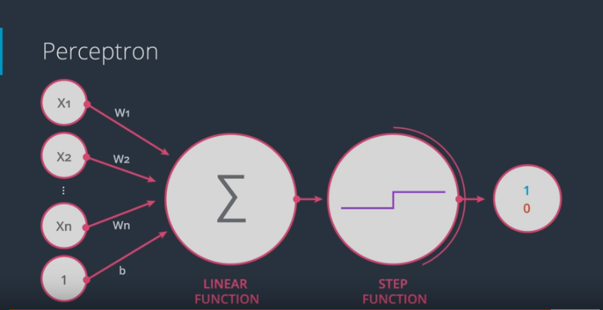
  </p>

  A perceptron that takes in n inputs, each multiplied by separate
  weights. The perceptron outputs a single value.

  Perceptrons are the (nodes) in deep neural networks. That is, a deep neural network consists of multiple connected perceptrons, plus a backpropagation algorithm to introduce feedback.

#### Why "Neural Networks"?

  <p align="center">
    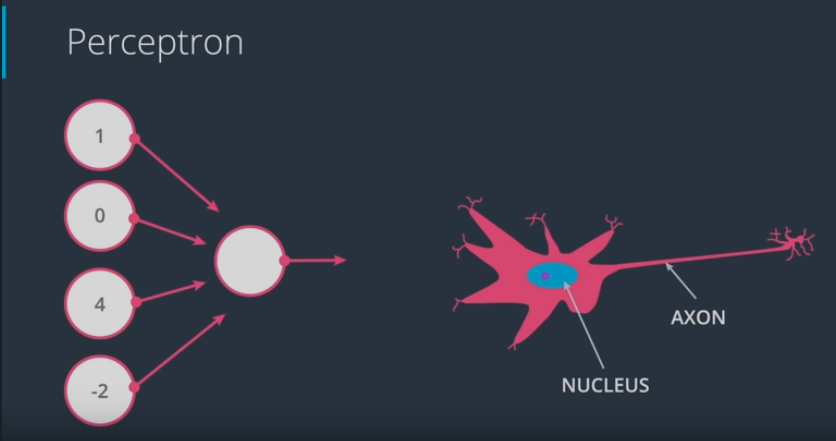
  </p>

#### Perceptrons as Logical Operators

* AND Perceptron

  <p align="center">
    
  </p>

* OR Perceptron

  <p align="center">
    
  </p>

    <p align="center">
    
  </p>

* NOT Perceptron
  Unlike the other perceptrons we looked at, the NOT operation only cares about one input. The operation returns a 0 if the input is 1 and a 1 if it's a 0. The other inputs to the perceptron are ignored.

* XOR Perceptron

  <p align="center">
    
  </p>

#### Perceptron Trick
<p align="center">
  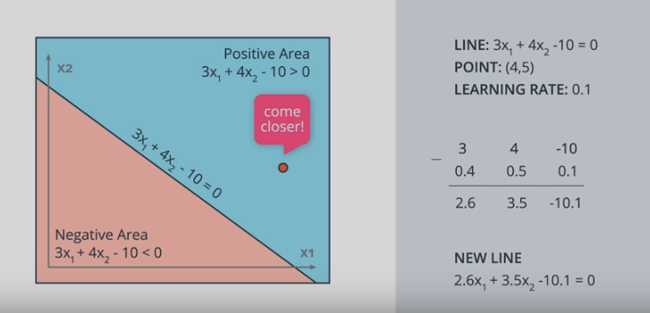
</p>

#### Perceptron Algorithm
<p align="center">
  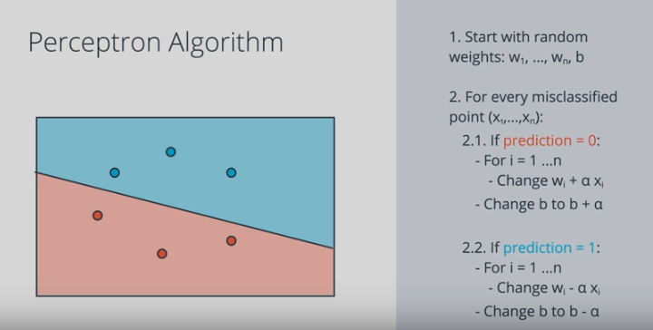
</p>

#### Non-Linear Regions
<p align="center">
  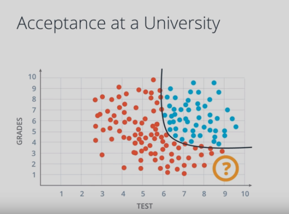
</p>

#### Error Functions
<p align="center">
  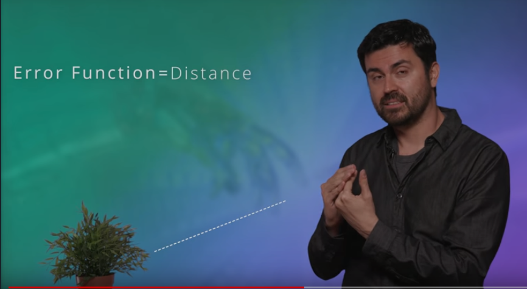
</p>

#### Log-loss Error Function
<p align="center">
  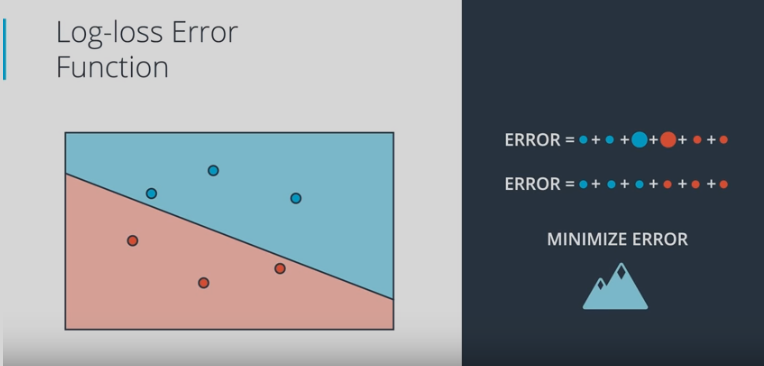
</p>

#### Discrete vs Continous
<p align="center">
  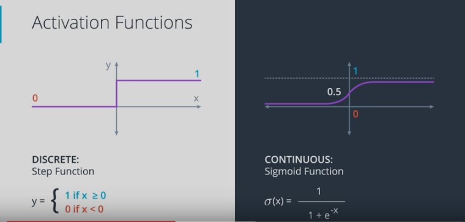
</p>

#### Softmax
A function that provides probabilities for each possible class in a multi-class classification model. The probabilities add up to exactly 1.0. For example, softmax might determine that the probability of a particular image being a duck at 0.67, a beaver at 0.33, and a walrus at 0. (Also called full softmax.)

<p align="center">
  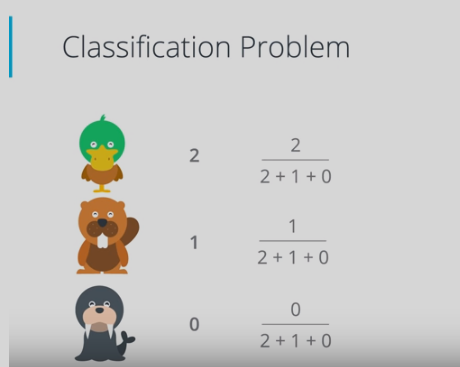
</p>

#### One-Hot Encoding

A sparse vector in which:

* One element is set to 1.
* All other elements are set to 0.

One-hot encoding is commonly used to represent strings or identifiers that have a finite set of possible values. For example, suppose a given botany data set chronicles 15,000 different species, each denoted with a unique string identifier. As part of feature engineering, you'll probably encode those string identifiers as one-hot vectors in which the vector has a size of 15,000.

<p align="center">
  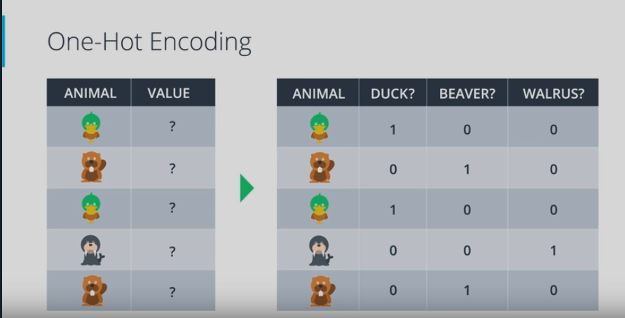
</p>


#### Maximum Likelihood
<p align="center">
  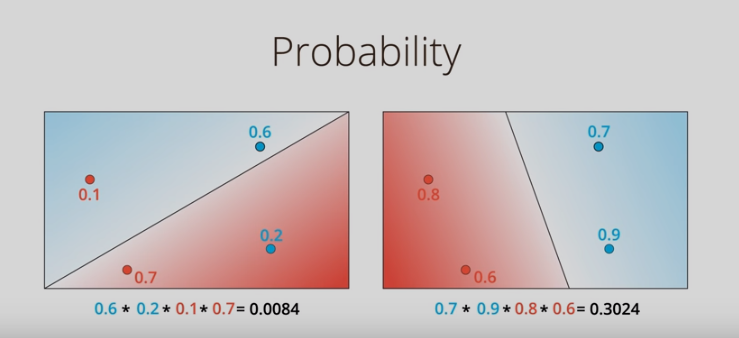
</p>

#### Cross-Entropy

A generalization of Log Loss to multi-class classification problems. Cross-entropy quantifies the difference between two probability distributions.

<p align="center">
  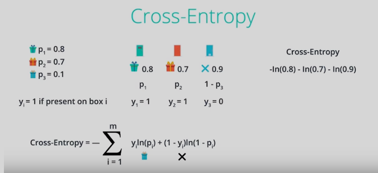
</p>

#### Multi-Class Cross Entropy
<p align="center">
  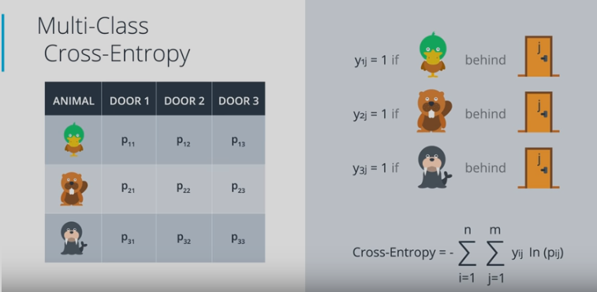
</p>

#### Logistic Regression
A model that generates a probability for each possible discrete label value in classification problems by applying a sigmoid function to a linear prediction. Although logistic regression is often used in binary classification problems, it can also be used in multi-class classification problems (where it becomes called multi-class logistic regression or multinomial regression).
<p align="center">
  
</p>

#### Gradient Descent
A technique to minimize loss by computing the gradients of loss with respect to the model's parameters, conditioned on training data. Informally, gradient descent iteratively adjusts parameters, gradually finding the best combination of weights and bias to minimize loss.
<p align="center">
  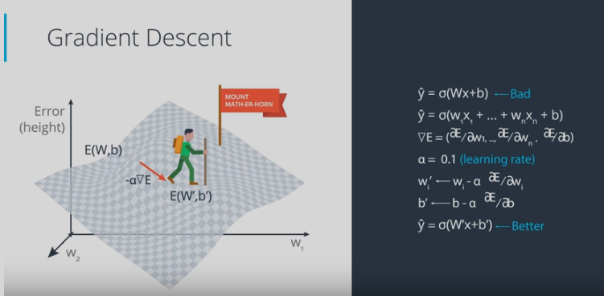
</p>

#### Feedforward
<p align="center">
  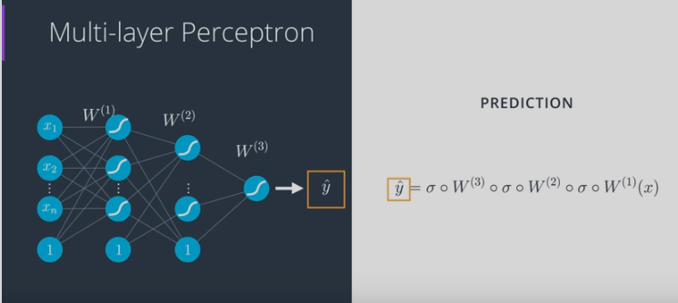
</p>

#### Backpropagation
The primary algorithm for performing gradient descent on neural networks. First, the output values of each node are calculated (and cached) in a forward pass. Then, the partial derivative of the error with respect to each parameter is calculated in a backward pass through the graph.
<p align="center">
  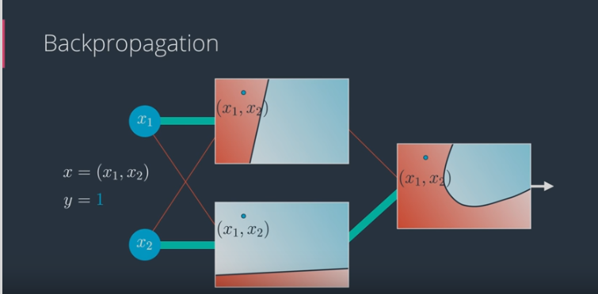
</p>

#### Overfitting & Underfitting
##### Overfitting
Creating a model that matches the training data so closely that the model fails to make correct predictions on new data.

##### Underfitting
Producing a model with poor predictive ability because the model hasn't captured the complexity of the training data. Many problems can cause underfitting, including:

* Training on the wrong set of features.
* Training for too few epochs or at too low a learning rate.
* Training with too high a regularization rate.
* Providing too few hidden layers in a deep neural network.

<p align="center">
  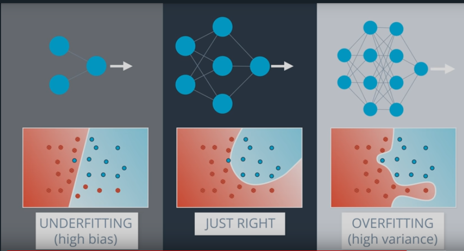
</p>

#### Early Stopping
A method for regularization that involves ending model training before training loss finishes decreasing. In early stopping, you end model training when the loss on a validation data set starts to increase, that is, when generalization performance worsens.
<p align="center">
  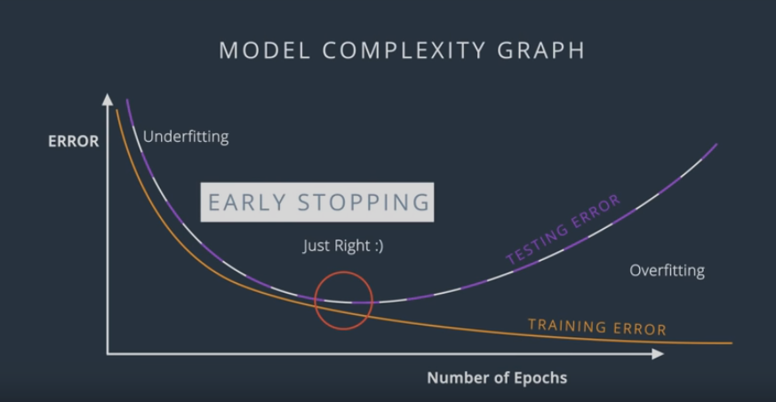
</p>

#### Regularization
The penalty on a model's complexity. Regularization helps prevent overfitting. Different kinds of regularization include:

* L1 regularization
* L2 regularization
* dropout regularization
* early stopping (this is not a formal regularization method, but can effectively limit overfitting)

<p align="center">
  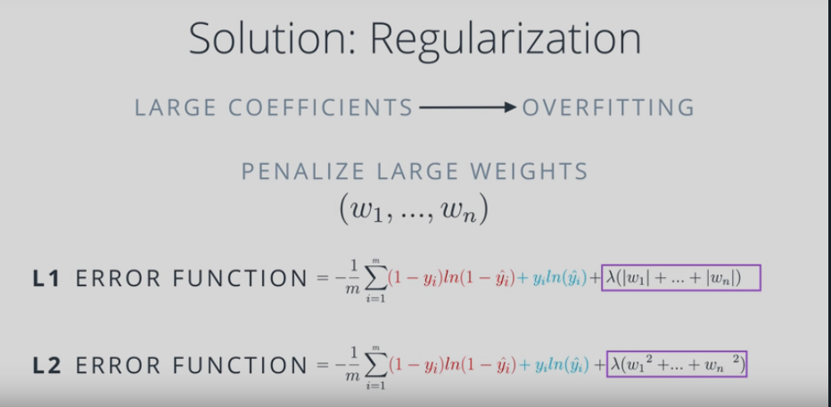
</p>

#### Dropout
A form of regularization useful in training neural networks. Dropout regularization works by removing a random selection of a fixed number of the units in a network layer for a single gradient step. The more units dropped out, the stronger the regularization. This is analogous to training the network to emulate an exponentially large ensemble of smaller networks.
<p align="center">
  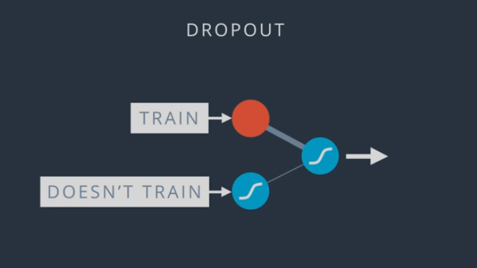
</p>

#### Local Minima
<p align="center">
  
</p>

#### Random Restart
<p align="center">
  
</p>

#### Momentum
A sophisticated gradient descent algorithm in which a learning step depends not only on the derivative in the current step, but also on the derivatives of the step(s) that immediately preceded it. Momentum involves computing an exponentially weighted moving average of the gradients over time, analogous to momentum in physics. Momentum sometimes prevents learning from getting stuck in local minima.
<p align="center">
  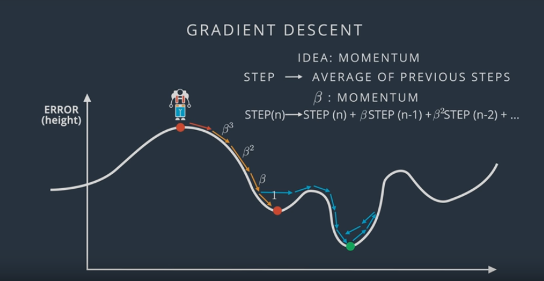
</p>

### Quizes
* [Centurion's Note](https://files.slack.com/files-pri/TDBKE3X9D-FE3CP0FNW/download/udacity-pytorch-lesson2-notes.pdf)

### Notebooks
* [Gradient Descent](https://github.com/agungsantoso/deep-learning-v2-pytorch/blob/master/intro-neural-networks/gradient-descent/GradientDescent.ipynb)
* [Analyzing Student Data](https://github.com/agungsantoso/deep-learning-v2-pytorch/blob/master/intro-neural-networks/student-admissions/StudentAdmissions.ipynb)

## Lesson 3: Talking PyTorch with Soumith Chintala
### Interview
#### Origins of PyTorch
*  Soumith Chintala always wanted to be a visual effects artist at least when he started his undergrad and then he interned at a place and they said he's not good enough
* He was good at programming since he was a kid
* He try to find the next most magical thing and that was computer vision
* He had to find a professor in India which is really hard to afford who's doing this kind of stuff and it was just like one or two and He spent six months with the professor's lab
* He started picking up some things then went to CMU tried his hand at robotics and then finally landed at NYU and Yann LeCun's lab doing deep learning
* He got to NYU, he've been working on building up tooling.
* He worked on this project called EB learn which was like two generations before in terms of deep learning
* Then came around torch which is written by a few people
* He started getting pretty active and helping people out using torch and then developing a torch
* At some point we decided that we needed a new tool because all the as the field moves
* I went about building PyTorch mostly because we had a really stressful project that was really large and hard to build
* We started with just three of us and then we got other people interested
* About eight or nine people joined in part-time just adding feature and then slowly and steadily we started giving access to other people
* every week we would give access to about like ten people
* and then in Jan be released by doors to the public

#### Debugging and Designing PyTorch
* if you have a non-contiguous tensor and sent it through a linear layer it will just give you garbage
* a trade-off there where the readability comes at a cost of it being a little bit slow
* it should be very imperative very usable very pythonic but at the same time as fast as any other framework
* the consequences of that was like large parts of PyTorch live in C++ except whatever is user-facing
* you can attach your debugger you can print, those are still very very hackable

#### From Research to Production
* we gave it a bunch of researchers and we took a rapid feedback from them and improve the product before it became mature so the core design of PyTorch is very very researcher friendly
*  PyTorch is designed with users and just their feedback in mind
* PyTorch especially in its latest version sort of does also add features that make it easier to deploy models to production
* We built PyTorch event geared for production is you do research but when you want it to be production ready you just add functional annotations to your model which are like these one-liners that are top of a function

#### Hybrid Frontend
* We called a new programming model hybrid front-end because you can make parts of a model like compiled parts of my model and gives you the best of both worlds

#### Cutting-edge Applications in PyTorch
* one paper written by one person Andy Brock it was called smash where one neural network would generate the weights that would be powered
* hierarchical story generation so you would see a story with like hey I want a story of a boy swimming in a pond and then it would actually like generate a story that's interesting with that plot
* openly available github repositories, it's also just like very readable of work where you look at something you can clearly see like here are the inputs here is what's happening as far as it being transformed and here are the desired outputs

#### User Needs and Adding Features
* what users are wanting especially with being able to put models to production
* when they're exploring new ideas they don't want to be seeing like a 10x drop in performance
* online courses they want more interactive tutorials like based on a Python notebooks 
* some widgets they want first-class integration with collab

#### PyTorch and the Facebook Product
* I sort of think of it as being a separate entity from from Facebook which i think you know it definitely has its own life and community
* we also have a huge set of needs for products at Facebook whether it's our camera enhancements or whether it is our machine translation or whether it's our accessibility interfaces or our integrity filtering

#### The Future of PyTorch
* the next thing I was thinking was deep learning itself is becoming a very pervasive and essential confident in many other fields

#### Learning More in AI
* Ethos that that as students are yet trying to get into the field of deep learning either to apply it to their own stuff or just to learn the concepts it's very important to make sure you do it from day one
* my only advice to people is to make sure you do lesser but like do it hands-on

## Lesson 4: Introduction to PyTorch

### Lectures

#### Single layer neural networks
* tensor

The primary data structure in TensorFlow programs. Tensors are N-dimensional (where N could be very large) data structures, most commonly scalars, vectors, or matrices. The elements of a Tensor can hold integer, floating-point, or string values.
<p align="center">
  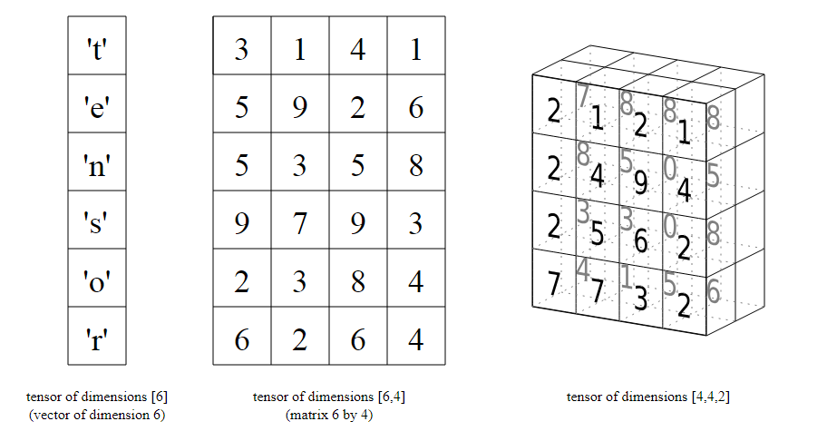
</p>

* [torch.sum()](https://pytorch.org/docs/stable/torch.html#torch.sum)
* [torch.mm()](https://pytorch.org/docs/stable/torch.html#torch.mm)
* [torch.matmul()](https://pytorch.org/docs/stable/torch.html#torch.matmul)
* [tensor.reshape()](https://pytorch.org/docs/stable/tensors.html#torch.Tensor.reshape)
* [tensor.resize()](https://pytorch.org/docs/stable/tensors.html#torch.Tensor.resize_)
* [tensor.view()](https://pytorch.org/docs/stable/tensors.html#torch.Tensor.view)

#### Networks Using Matrix Multiplication
* hyperparameter

The "knobs" that you tweak during successive runs of training a model. For example, learning rate is a hyperparameter.

#### Neural Networks in PyTorch
* neural network

A model that, taking inspiration from the brain, is composed of layers (at least one of which is hidden) consisting of simple connected units or neurons followed by nonlinearities.

* MNIST (Modified National Institute of Standards and Technology database)

A public-domain data set compiled by LeCun, Cortes, and Burges containing 60,000 images, each image showing how a human manually wrote a particular digit from 0–9. Each image is stored as a 28x28 array of integers, where each integer is a grayscale value between 0 and 255, inclusive.
<p align="center">
  
</p>

* activation function

A function (for example, ReLU or sigmoid) that takes in the weighted sum of all of the inputs from the previous layer and then generates and passes an output value (typically nonlinear) to the next layer.
 
 * [nn.Sequential](https://pytorch.org/docs/master/nn.html#torch.nn.Sequential)

#### Network Architectures in PyTorch
* backpropagation

The primary algorithm for performing gradient descent on neural networks. First, the output values of each node are calculated (and cached) in a forward pass. Then, the partial derivative of the error with respect to each parameter is calculated in a backward pass through the graph.

* batch

The set of examples used in one iteration (that is, one gradient update) of model training.

* batch size

The number of examples in a batch. For example, the batch size of SGD is 1, while the batch size of a mini-batch is usually between 10 and 1000. Batch size is usually fixed during training and inference;

* cross-entropy

A generalization of Log Loss to multi-class classification problems. Cross-entropy quantifies the difference between two probability distributions

* epoch

A full training pass over the entire data set such that each example has been seen once. Thus, an epoch represents N/batch size training iterations, where N is the total number of examples.

* hidden layer

A synthetic layer in a neural network between the input layer (that is, the features) and the output layer (the prediction). Hidden layers typically contain an activation function (such as ReLU) for training. A deep neural network contains more than one hidden layer.

* logits

The vector of raw (non-normalized) predictions that a classification model generates, which is ordinarily then passed to a normalization function. If the model is solving a multi-class classification problem, logits typically become an input to the softmax function. The softmax function then generates a vector of (normalized) probabilities with one value for each possible class.

* optimizer

A specific implementation of the gradient descent algorithm.

* step

A forward and backward evaluation of one batch.
step size
Synonym for learning rate.

* stochastic gradient descent (SGD)

A gradient descent algorithm in which the batch size is one. In other words, SGD relies on a single example chosen uniformly at random from a data set to calculate an estimate of the gradient at each step.

* [nn.CrossEntropyLoss](https://pytorch.org/docs/stable/nn.html#torch.nn.CrossEntropyLoss)
* [nn.LogSoftmax](https://pytorch.org/docs/stable/nn.html#torch.nn.LogSoftmax)
* [nn.NLLLoss](https://pytorch.org/docs/stable/nn.html#torch.nn.NLLLoss)
* [Optim Package](https://pytorch.org/docs/stable/optim.html)

#### Classifying Fashion-MNIST
* [the criterion](https://pytorch.org/docs/master/nn.html#loss-functions)
* [the optimizer](http://pytorch.org/docs/master/optim.html)

#### Inference and Validation
* dropout regularization

A form of regularization useful in training neural networks. Dropout regularization works by removing a random selection of a fixed number of the units in a network layer for a single gradient step. The more units dropped out, the stronger the regularization. This is analogous to training the network to emulate an exponentially large ensemble of smaller networks.

* inference

In machine learning, often refers to the process of making predictions by applying the trained model to unlabeled examples. In statistics, inference refers to the process of fitting the parameters of a distribution conditioned on some observed data. (See the Wikipedia article on statistical inference.)

* overfitting

Creating a model that matches the training data so closely that the model fails to make correct predictions on new data.

* precision

A metric for classification models. Precision identifies the frequency with which a model was correct when predicting the positive class.

* recall

A metric for classification models that answers the following question: Out of all the possible positive labels, how many did the model correctly identify?

* validation set

A subset of the data set—disjunct from the training set—that you use to adjust hyperparameters.

* [nn.Dropout](https://pytorch.org/docs/stable/nn.html#torch.nn.Dropout)

#### Saving and Loading Models
* checkpoint

Data that captures the state of the variables of a model at a particular time. Checkpoints enable exporting model weights, as well as performing training across multiple sessions. Checkpoints also enable training to continue past errors (for example, job preemption). Note that the graph itself is not included in a checkpoint.

#### Loading Image Data
* [`datasets.ImageFolder`](http://pytorch.org/docs/master/torchvision/datasets.html#imagefolder)
* [`transforms`](http://pytorch.org/docs/master/torchvision/transforms.html)
  * [`DataLoader`]  (http://pytorch.org/docs/master/data.html#torch.utils.data.DataLoader)

#### Transfer Learning
* [model](http://pytorch.org/docs/0.3.0/torchvision/models.html)
* [CUDA](https://developer.nvidia.com/cuda-zone)

#### Tips, Tricks, and Other Notes
* Make use of the .shape method during debugging and development.
* Make sure you're clearing the gradients in the training loop with `optimizer.zero_grad()`. 
* If you're doing a validation loop, be sure to set the network to evaluation mode with `model.eval()`, then back to training mode with `model.train()`.
* If you're trying to run your network on the GPU, check to make sure you've moved the model and all necessary tensors to the GPU with `.to(device)` where device is either `"cuda"` or `"cpu"`

### Notebooks
* [Tensors in PyTorch](https://github.com/agungsantoso/deep-learning-v2-pytorch/blob/master/intro-to-pytorch/Part%201%20-%20Tensors%20in%20PyTorch%20(Exercises).ipynb)
* [Neural networks with PyTorch](https://github.com/agungsantoso/deep-learning-v2-pytorch/blob/master/intro-to-pytorch/Part%202%20-%20Neural%20Networks%20in%20PyTorch%20(Exercises).ipynb)
* [Training Neural Networks](https://github.com/agungsantoso/deep-learning-v2-pytorch/blob/master/intro-to-pytorch/Part%203%20-%20Training%20Neural%20Networks%20(Exercises).ipynb)
* [Classifying Fashion-MNIST](https://github.com/agungsantoso/deep-learning-v2-pytorch/blob/master/intro-to-pytorch/Part%204%20-%20Fashion-MNIST%20(Exercises).ipynb)
* [Inference and Validation](https://github.com/agungsantoso/deep-learning-v2-pytorch/blob/master/intro-to-pytorch/Part%205%20-%20Inference%20and%20Validation%20(Exercises).ipynb)
* [Saving and Loading Models](https://github.com/agungsantoso/deep-learning-v2-pytorch/blob/master/intro-to-pytorch/Part%206%20-%20Saving%20and%20Loading%20Models.ipynb)
* [Loading Image Data](https://colab.research.google.com/github/agungsantoso/deep-learning-v2-pytorch/blob/master/intro-to-pytorch/Part%207%20-%20Loading%20Image%20Data%20(Exercises).ipynb#scrollTo=IVfPhjj-OCqv)
* [Transfer Learning](https://colab.research.google.com/github/agungsantoso/deep-learning-v2-pytorch/blob/master/intro-to-pytorch/Part%208%20-%20Transfer%20Learning%20(Exercises).ipynb#scrollTo=4_6rfBV_RLSA)

### Tips & Trick
#### [Things to run torch Training with GPU in colab](https://pytorchfbchallenge.slack.com/archives/CE15VH5KJ/p1543083497415500)
* install pytorch
```
# http://pytorch.org/
from os.path import exists
from wheel.pep425tags import get_abbr_impl, get_impl_ver, get_abi_tag
platform = '{}{}-{}'.format(get_abbr_impl(), get_impl_ver(), get_abi_tag())
cuda_output = !ldconfig -p|grep cudart.so|sed -e 's/.*\.\([0-9]*\)\.\([0-9]*\)$/cu\1\2/'
accelerator = cuda_output[0] if exists('/dev/nvidia0') else 'cpu'

!pip install -q http://download.pytorch.org/whl/{accelerator}/torch-0.4.1-{platform}-linux_x86_64.whl torchvision
import torch
```

* download dataset
```
!wget -c https://s3.amazonaws.com/content.udacity-data.com/nd089/Cat_Dog_data.zip;
!unzip -qq Cat_Dog_data.zip;
!wget -c https://raw.githubusercontent.com/udacity/deep-learning-v2-pytorch/master/intro-to-pytorch/helper.py
```

* other dependencies
```
!pip install Pillow==4.0.0
!pip install PIL
!pip install image
import PIL
```

* Click `Runtime` - `change Run time type`
* Click `GPU`


## Lesson 5 : Convolutional Neural Networks
### Lectures
#### Applications of CNNs
* [WaveNet](https://deepmind.com/blog/wavenet-generative-model-raw-audio/)
* [Text Classification](http://www.wildml.com/2015/12/implementing-a-cnn-for-text-classification-in-tensorflow/)
* [Language Translation](https://code.facebook.com/posts/1978007565818999/a-novel-approach-to-neural-machine-translation/)
* [Play Atari games](https://deepmind.com/research/dqn/)
* [Play Pictionary](https://quickdraw.withgoogle.com/#)
* [Play Go](https://deepmind.com/research/alphago/)
* [CNNs powered Drone](https://www.youtube.com/watch?v=wSFYOw4VIYY)
* Self-Driving Car
* [Predict depth from a single image](https://www.cs.nyu.edu/~deigen/depth/)
* [Localize breast cancer](https://research.googleblog.com/2017/03/assisting-pathologists-in-detecting.html)
* [Save endangered species](https://blogs.nvidia.com/blog/2016/11/04/saving-endangered-species/?adbsc=social_20170303_70517416)
* [Face App](http://www.digitaltrends.com/photography/faceapp-neural-net-image-editing/)

#### Lesson Outline
* About CNN (Convolutional Neural Network) and how they improve our ability to classify images
* How CNN identify features and how CNN can be used for image classification
* Various layer that make up a complete CNN
* __A feature__ is to think about what we are visually drawn to when we first see an object and when we identify different objects. For example what do we look at to distinguish a cat and a dog? The shape of the eyes, the size, and how they move

#### MNIST Dataset
<p align="center">
  
</p>

* Most famous database

<p align="center">
  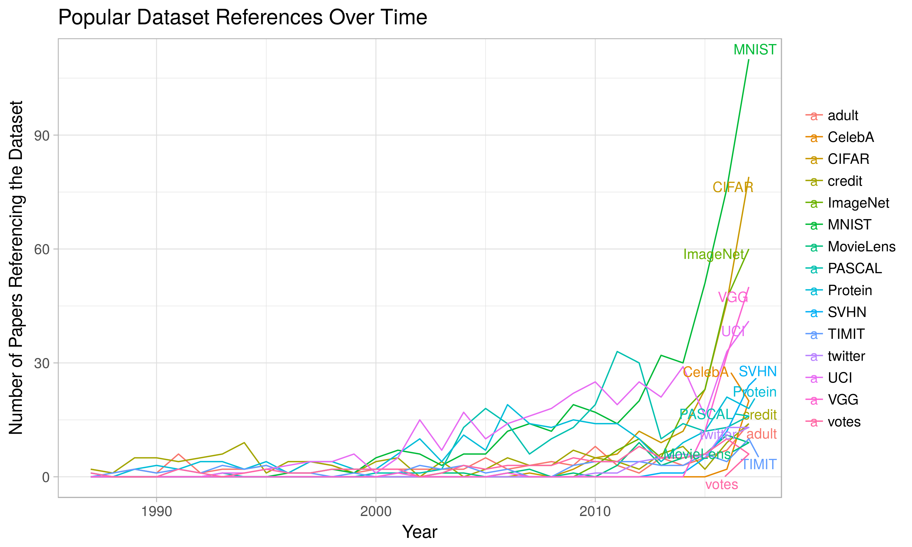
</p>

#### How Computers Interpret Images
<p align="center">
  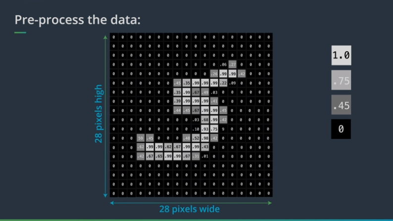
</p>

* __Data normalization__ is an important pre-processing step. It ensures that each input (each pixel value, in this case) comes from a standard distribution. 

* [Normalize transformation in PyTorch](https://pytorch.org/docs/stable/torchvision/transforms.html#transforms-on-torch-tensor)

<p align="center">
  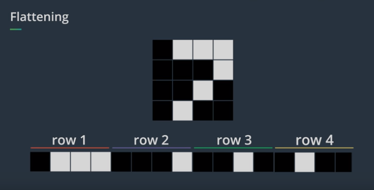
</p>

#### MLP (Multi Layer Perceptron) Structure & Class Scores
<p align="center">
  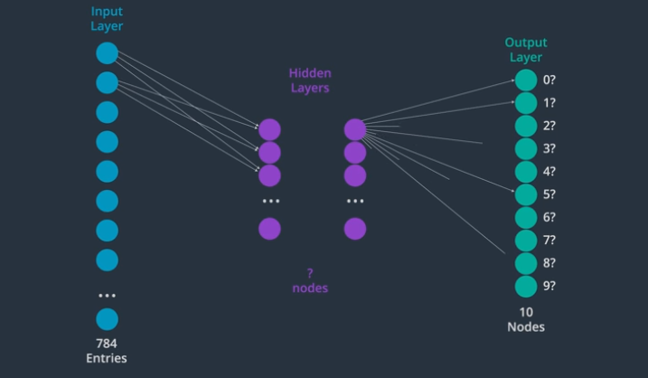
</p>
* layer

A set of neurons in a neural network that process a set of input features, or the output of those neurons.

Layers are Python functions that take Tensors and configuration options as input and produce other tensors as output. Once the necessary Tensors have been composed, the user can convert the result into an Estimator via a model function.

<p align="center">
  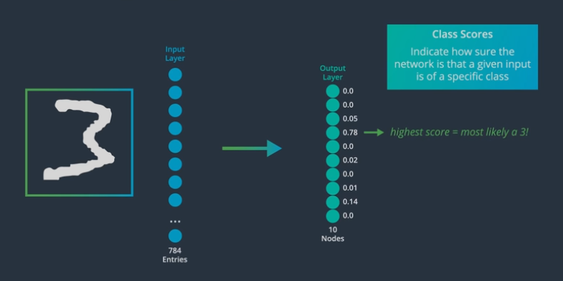
</p>

* class

One of a set of enumerated target values for a label. For example, in a binary classification model that detects spam, the two classes are spam and not spam. In a multi-class classification model that identifies dog breeds, the classes would be poodle, beagle, pug, and so on.

* scoring

The part of a recommendation system that provides a value or ranking for each item produced by the candidate generation phase.

#### Do Your Research
* More hidden layers generally means more ability to recognize complex pattern
* One or two hidden layers should work fine for small images
* Keep looking for a resource or two that appeals to you
* Try out the models in code

<p align="center">
  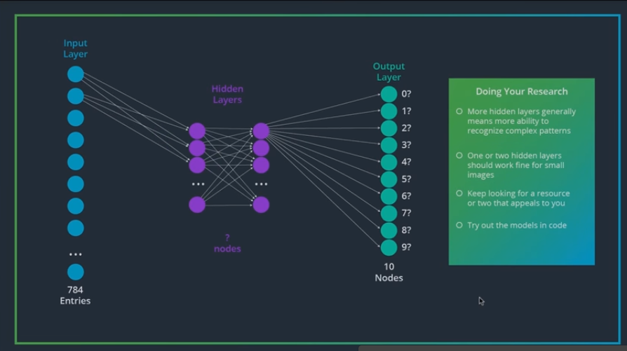
</p>

#### Loss & Optimization

<p align="center">
  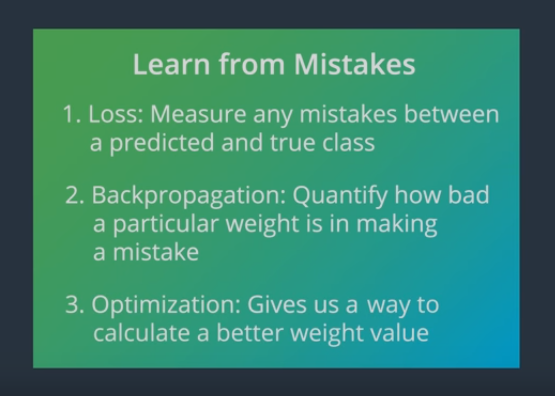
</p>

<p align="center">
  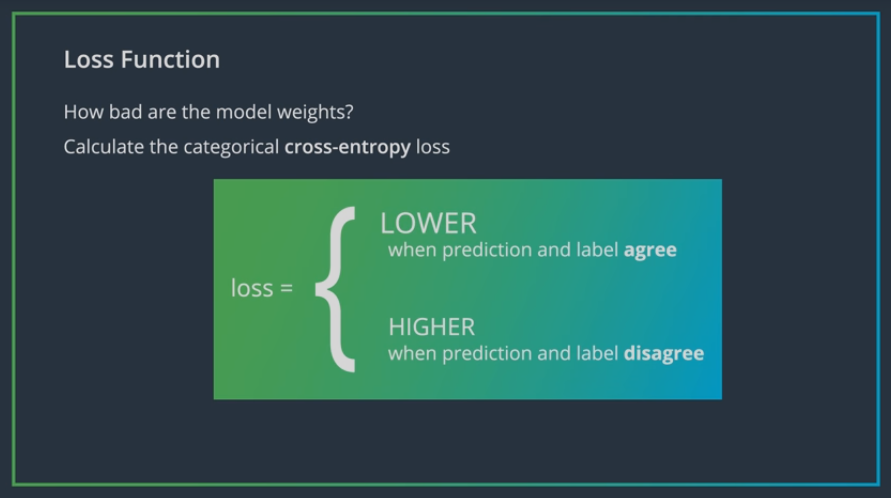
</p>

<p align="center">
  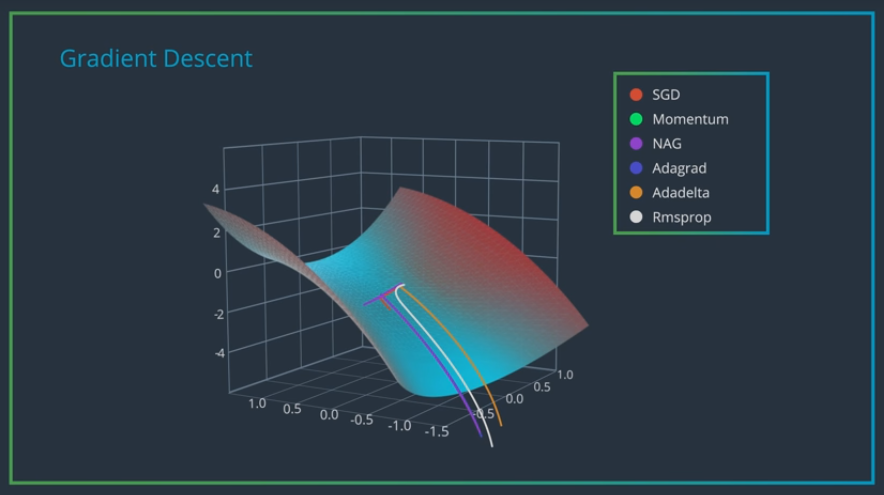
</p>

#### Defining a Network in PyTorch
* Rectified Linear Unit (ReLU)

An activation function with the following rules:
  * If input is negative or zero, output is 0.
  * If input is positive, output is equal to input.

<p align="center">
  
</p>

#### Training the Network
The steps for training/learning from a batch of data are described in the comments below:

1. Clear the gradients of all optimized variables
2. Forward pass: compute predicted outputs by passing inputs to the model
3. Calculate the loss
4. Backward pass: compute gradient of the loss with respect to model parameters
5. Perform a single optimization step (parameter update)
6. Update average training loss

#### One Solution
* `model.eval()` will set all the layers in your model to evaluation mode. 
* This affects layers like dropout layers that turn "off" nodes during training with some probability, but should allow every node to be "on" for evaluation. 
* So, you should set your model to evaluation mode before testing or validating your model and set it to `model.train()` (training mode) only during the training loop.

#### Model Validation
<p align="center">
  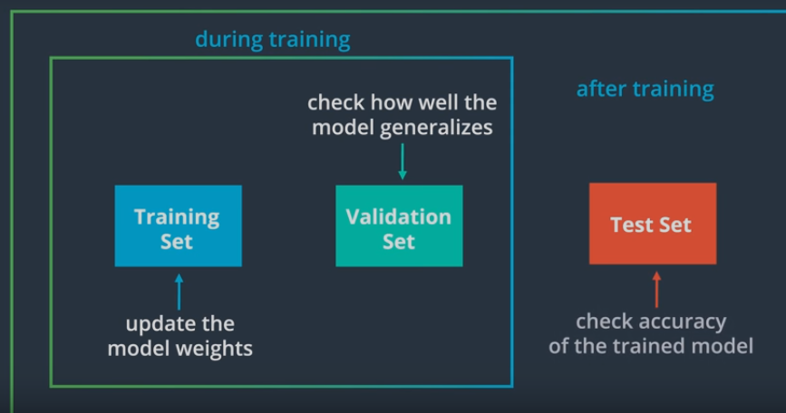
</p>

<p align="center">
  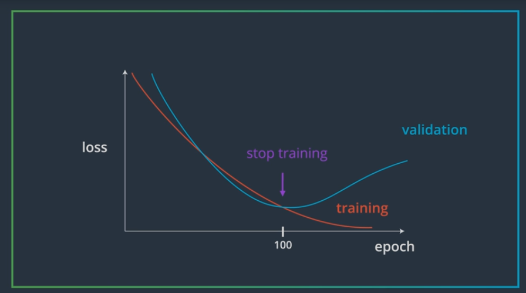
</p>

#### Validation Loss
* We create a validation set to:
  1. Measure how well a model generalizes, during training
  2. Tell us when to stop training a model; when the validation loss stops decreasing (and especially when the validation loss starts increasing and the training loss is still decreasing)

#### Image Classification Steps
<p align="center">
  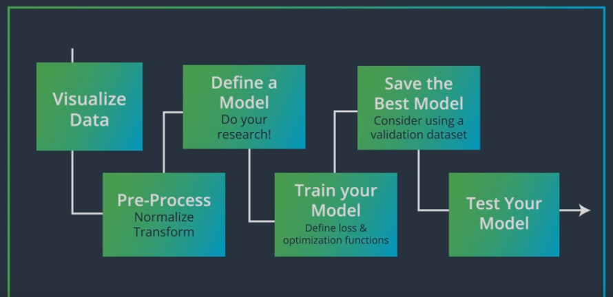
</p>

#### MLPs vs CNNs
* MNIST already centered, real image can be any position
<p align="center">
  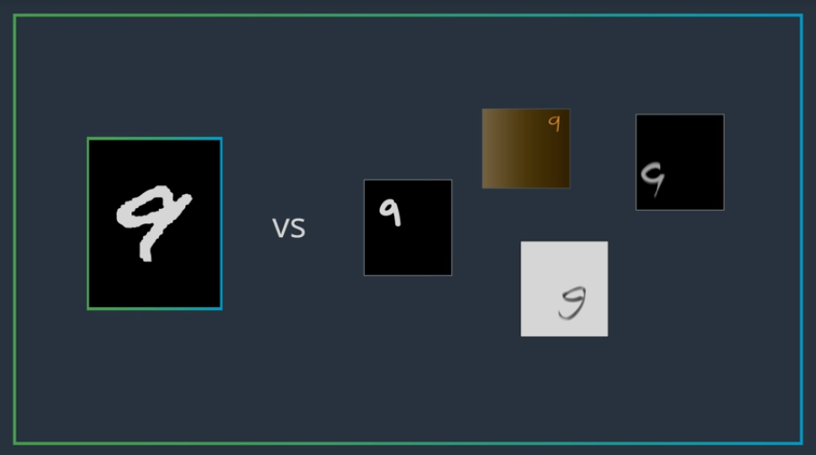
</p>

#### Local Connectivity
* Difference between MLP vs CNN
<p align="center">
  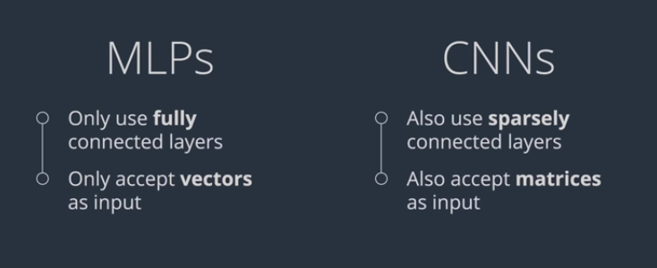
</p>

* Sparsely connected layer
<p align="center">
  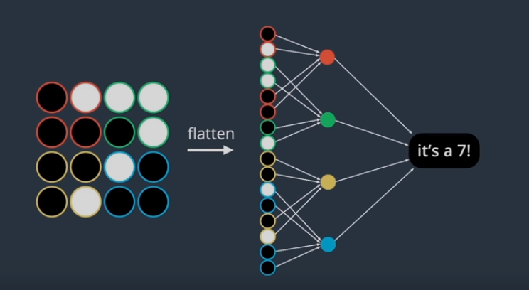
</p>

#### Filters and the Convolutional Layer
* CNN is special kind of NN that can remember spatial information
* The key to remember spatial information is convolutional layer, which apply series of different image filters (convolutional kernels) to input image

<p align="center">
  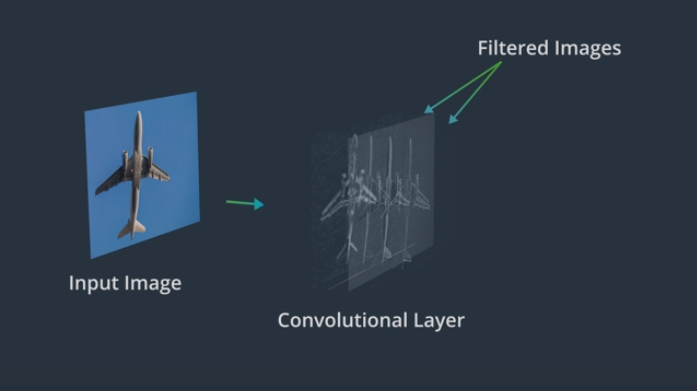
</p>

* CNN should learn to identify spatial patterns like curves and lines that make up number six

<p align="center">
  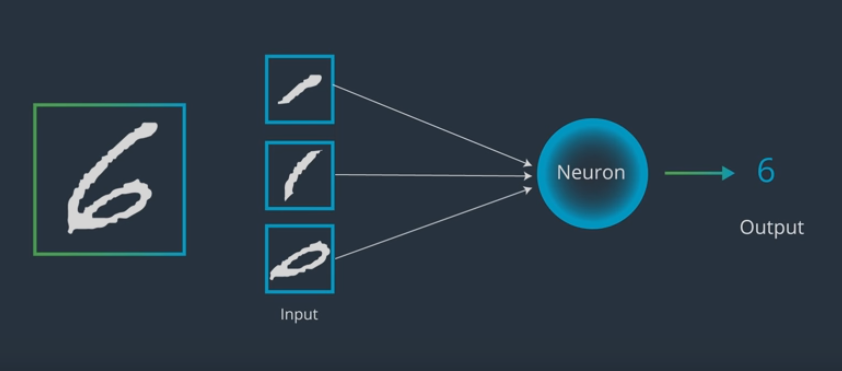
</p>

#### Filters & Edges
* Intensity is a measure of light and dark, similiar to brightness
* To identify the edges of an object, look at abrupt changes in intensity
* Filters

  To detect changes in intensity in an image, look at groups of pixels and react to alternating patterns of dark/light pixels. Producing an output that shows edges of objects and differing textures.

* Edges

  Area in images where the intensity changes very quickly

#### Frequency in Images

<p align="center">
  
</p>

* Frequency in images is a __rate of change__.
  * on the scarf and striped shirt, we have a high-frequency image pattern
  * parts of the sky and background that change very gradually, which is considered a smooth, low-frequency pattern
* __High-frequency components__ also correspond to __the edges__ of objects in images, which can help us classify those objects.

#### High-pass Filters
<p align="center">
  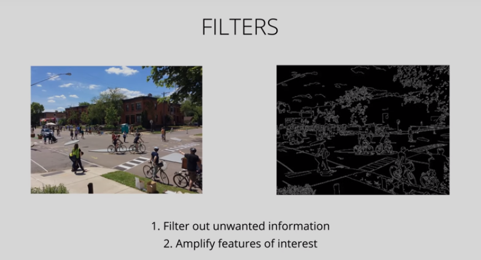
</p>
<p align="center">
  
</p>
<p align="center">
  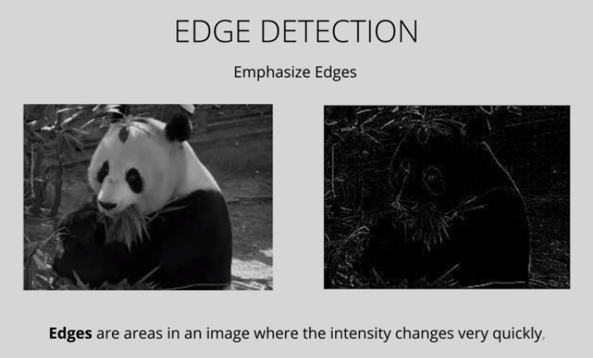
</p>
<p align="center">
  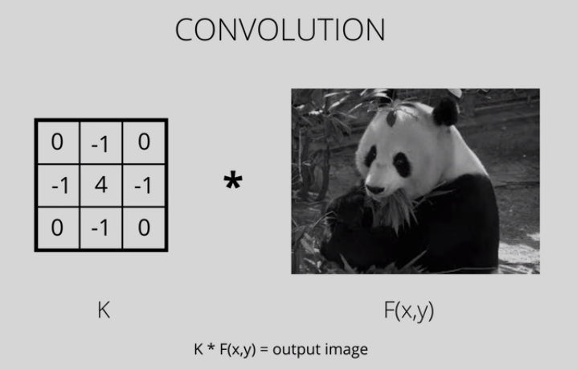
</p>
<p align="center">
  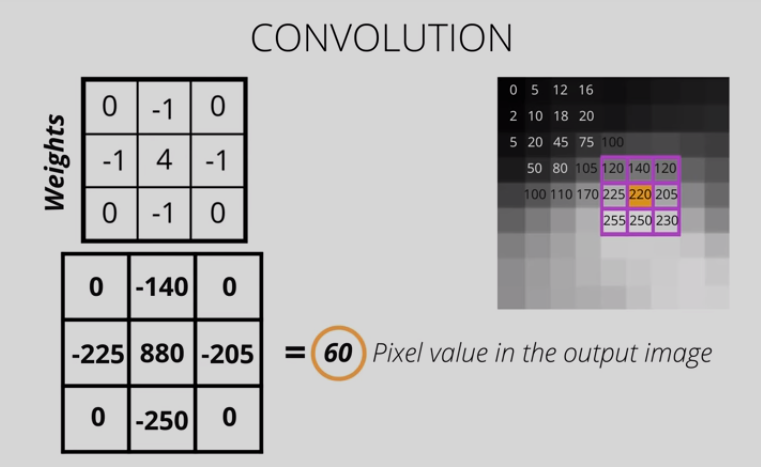
</p>

* Edge Handling
  * __Extend__  Corner pixels are extended in 90° wedges. Other edge pixels are extended in lines.
  * __Padding__ The image is padded with a border of 0's, black pixels.
  * __Crop__ Any pixel in the output image which would require values from beyond the edge is skipped.


#### OpenCV & Creating Custom Filters
* [OpenCV](http://opencv.org/about.html) is a computer vision and machine learning software library that includes many common image analysis algorithms that will help us build custom, intelligent computer vision applications.

#### Convolutional Layer
A layer of a deep neural network in which a convolutional filter passes along an input matrix. For example, consider the following 3x3 convolutional filter:

<p align="center">
  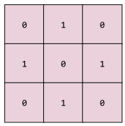
</p>

The following animation shows a convolutional layer consisting of 9 convolutional operations involving the 5x5 input matrix. Notice that each convolutional operation works on a different 3x3 slice of the input matrix. The resulting 3x3 matrix (on the right) consists of the results of the 9 convolutional operations:

<p align="center">
  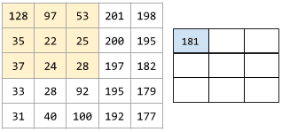
</p>

<p align="center">
  
</p>

<p align="center">
  
</p>

* convolutional neural network

  A neural network in which at least one layer is a convolutional layer. A typical convolutional neural network consists of some combination of the following layers:

  * convolutional layers
  * pooling layers
  * dense layers

  Convolutional neural networks have had great success in certain kinds of problems, such as image recognition.

<p align="center">
  
</p>

* See Also:
  * [Convolution](https://developers.google.com/machine-learning/glossary/#convolution)
  * [Convolutional Filter](https://developers.google.com/machine-learning/glossary/#convolutional_filter)
  * [Convolutional Operation](https://developers.google.com/machine-learning/glossary/#convolutional_operation)

#### Convolutional Layers (Part 2)
* Grayscale image -> 2D Matrix
* Color image -> 3 layers of 2D Matrix, one for each channel (Red, Green, Blue)

<p align="center">
  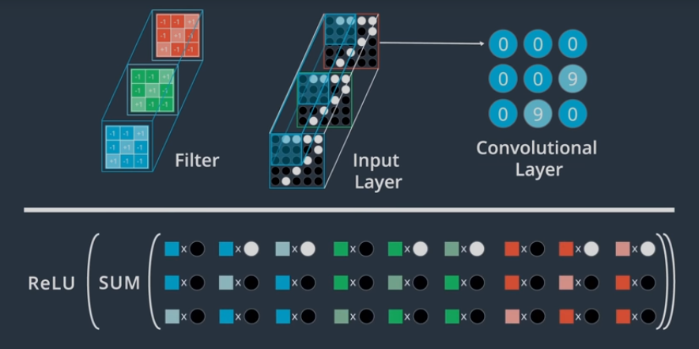
</p>

#### Stride and Padding
* Increase __the number of node__ in convolutional layer -> increase __the number of filter__ 
* increase __the size of detected pattern__ -> increase __the size of filter__
* __Stride__ is the amount by which the filter slides over the image
* Size of convolutional layer depend on what we do at the edge of our image

<p align="center">
  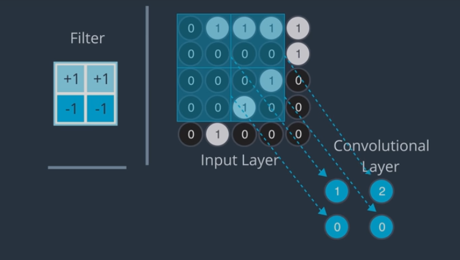
</p>

* __Padding__ give filter more space to move by padding zeros to the edge of image

<p align="center">
  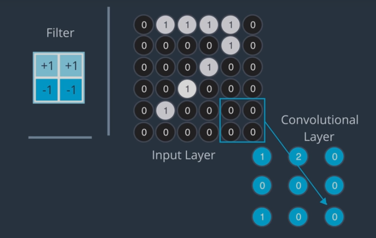
</p>

#### Pooling Layers
* pooling
  
  Reducing a matrix (or matrices) created by an earlier convolutional layer to a smaller matrix. Pooling usually involves taking either the maximum or average value across the pooled area. For example, suppose we have the following 3x3 matrix:

  <p align="center">
    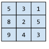
  </p>

  A pooling operation, just like a convolutional operation, divides that matrix into slices and then slides that convolutional operation by strides. For example, suppose the pooling operation divides the convolutional matrix into 2x2 slices with a 1x1 stride. As the following diagram illustrates, four pooling operations take place. Imagine that each pooling operation picks the maximum value of the four in that slice:

  <p align="center">
    
  </p>

  Pooling helps enforce translational invariance in the input matrix.

  Pooling for vision applications is known more formally as spatial pooling. Time-series applications usually refer to pooling as temporal pooling. Less formally, pooling is often called subsampling or downsampling.

#### Increasing Depth
* Incresing depth is actually:
  * extracting more and more complex pattern and features that help identify the content and the objects in an image
  * discarding some spatial information abaout feature like a smooth background that don't help identify the image

<p align="center">
  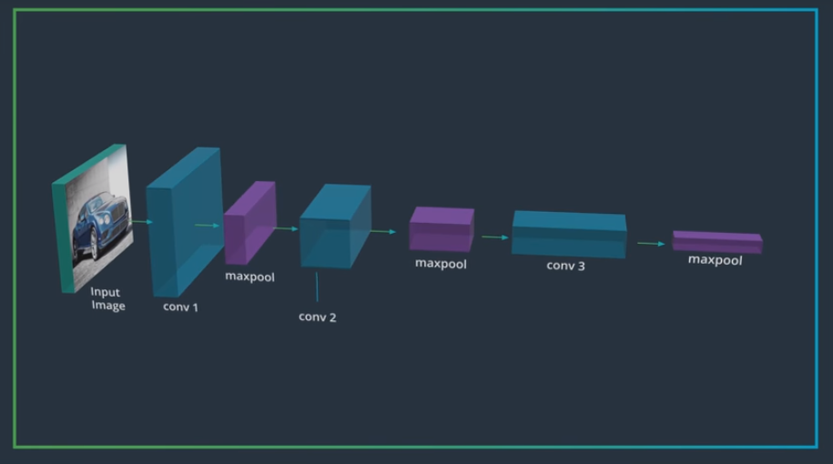
</p>

#### CNNs for Image Classification

<p align="center">
  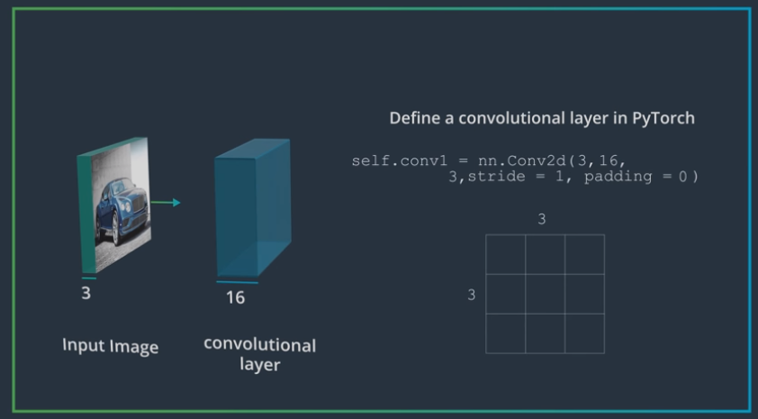
</p>

<p align="center">
  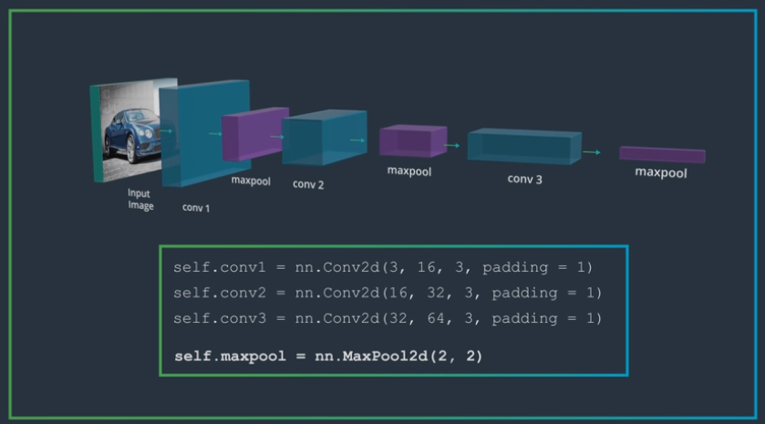
</p>

#### Convolutional Layers in PyTorch
* init

```
self.conv1 = nn.Conv2d(in_channels, out_channels, kernel_size, stride=1, padding=0)
```

* forward

```
x = F.relu(self.conv1(x))
```

* arguments
  * `in_channels` - number of inputs (in depth)
  * `out_channels` - number of output channels
  * `kernel_size` - height and width (square) of convolutional kernel
  * `stride` - default `1`
  * `padding` - default `0`
  * [documentation](https://pytorch.org/docs/stable/nn.html#conv2d)

* pooling layers

  down sampling factors

  ```
  self.pool = nn.MaxPool2d(2,2)
  ```

  * forward

  ```
  x = F.relu(self.conv1(x))
  x = self.pool(x)
  ```

  * example #1

  ```
  self.conv1 = nn.Conv2d(1, 16, 2, stride=2)
  ```

    * grayscale images (1 depth)
    * 16 filter
    * filter size 2x2
    * filter jump 2 pixels at a time

  * example #2  

  ```
  self.conv2 = nn.Conv2d(16, 32, 3, padding=1)
  ```

    * 16 input from output of example #1
    * 32 filters
    * filter size 3x3
    * jump 1 pixel at a time

* sequential models
    
  ```
  def __init__(self):
        super(ModelName, self).__init__()
        self.features = nn.Sequential(
              nn.Conv2d(1, 16, 2, stride=2),
              nn.MaxPool2d(2, 2),
              nn.ReLU(True),

              nn.Conv2d(16, 32, 3, padding=1),
              nn.MaxPool2d(2, 2),
              nn.ReLU(True) 
         )
  ```

  * formula: number of parameters in a convolutional layer

    * `K` - number of filter
    * `F` - filter size
    * `D_in` - last value in the `input shape`
    
    `(K * F*F * D_in) + K`

  * formula: shape of a convolutional layer

    * `K` - number of filter
    * `F` - filter size
    * `S` - stride
    * `P` - padding
    * `W_in` - size of prev layer

    `((W_in - F + 2P) / S) + 1`

* flattening

  to make all parameters can be seen (as a vector) by a linear classification layer

#### Feature Vector
* a representation that encodes only the content of the image
* often called a feature level representation of an image

<p align="center">
  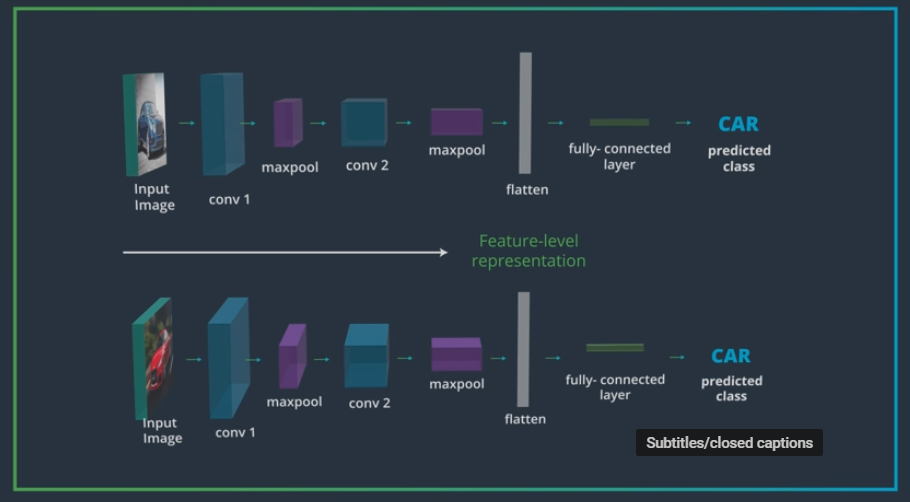
</p>

#### CIFAR Classification Example
* CIFAR-10 (Canadian Institute For Advanced Research) is a popular dataset of 60,000 tiny images

#### Image Augmentation
* data augmentation

  Artificially boosting the range and number of training examples by transforming existing examples to create additional examples. For example, suppose images are one of your features, but your data set doesn't contain enough image examples for the model to learn useful associations. Ideally, you'd add enough labeled images to your data set to enable your model to train properly. If that's not possible, data augmentation can rotate, stretch, and reflect each image to produce many variants of the original picture, possibly yielding enough labeled data to enable excellent training.

<p align="center">
  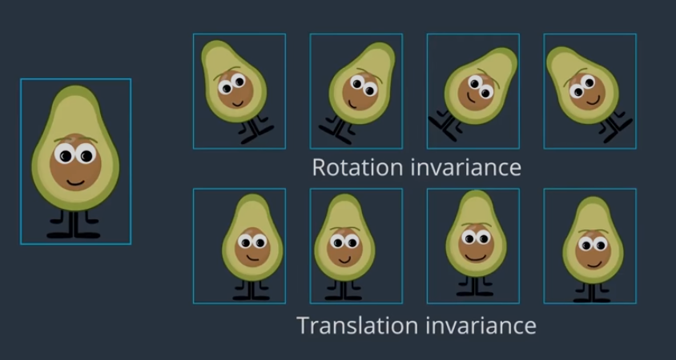
</p>

* translational invariance
 
  In an image classification problem, an algorithm's ability to successfully classify images even when the position of objects within the image changes. For example, the algorithm can still identify a dog, whether it is in the center of the frame or at the left end of the frame.

* size invariance
 
  In an image classification problem, an algorithm's ability to successfully classify images even when the size of the image changes. For example, the algorithm can still identify a cat whether it consumes 2M pixels or 200K pixels. Note that even the best image classification algorithms still have practical limits on size invariance. For example, an algorithm (or human) is unlikely to correctly classify a cat image consuming only 20 pixels.

* rotational invariance

  In an image classification problem, an algorithm's ability to successfully classify images even when the orientation of the image changes. For example, the algorithm can still identify a tennis racket whether it is pointing up, sideways, or down. Note that rotational invariance is not always desirable; for example, an upside-down 9 should not be classified as a 9.

#### Groundbreaking CNN Architectures
* Since 2010, ImageNet project has held the ImageNet Large Scale Visual Recognition Competition, annual competition for the best CNN for object recognition and classification
* First breakthrough was in 2012, the network called AlexNet was developed by a team at the University of Toronto, they pioneered the use of the ReLU activation function and dropout as a technicque for avoiding overfitting

<p align="center">
  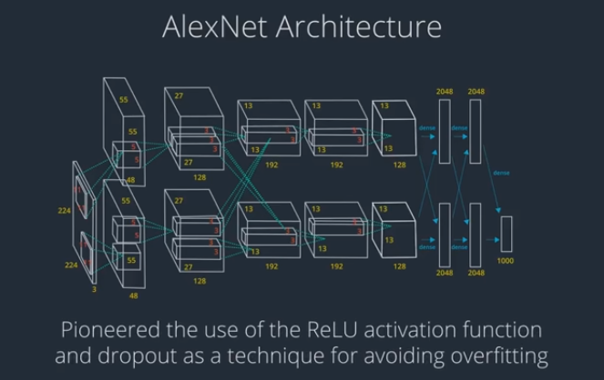
</p>

* 2014 winner was VGGNet often reffered to as just VGG (Visual Geometry Group) at Oxford University, has two version VGG 16 and VGG 19

<p align="center">
  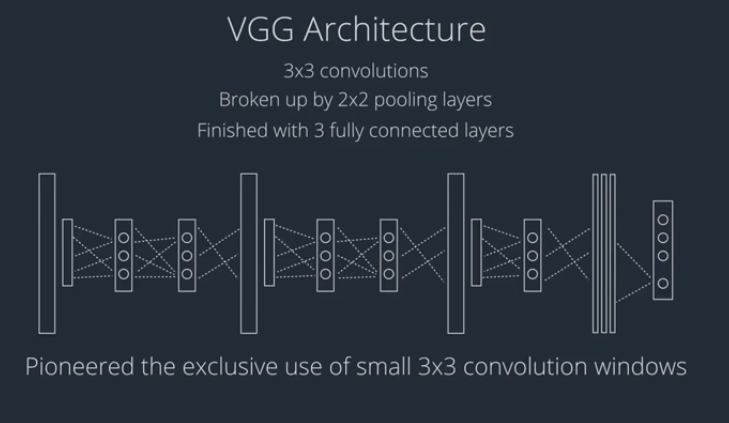
</p>


* 2015 winner was Microsoft Research called ResNet, like VGG, largest groundbreaking has 152 layers, can solve vanishing gradient problem, achieves superhuman performances in classifying images in ImageNet database

<p align="center">
  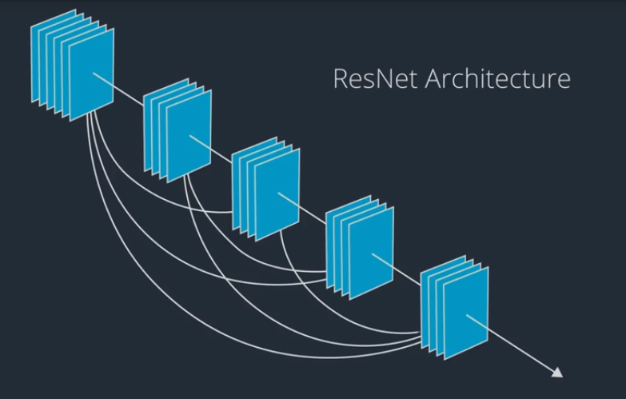
</p>

#### Visualizing CNNs (Part 1)
* visualizing the activation maps and convolutional layers
* taking filter from convolutional layers and constructing images that maximize their activations, google researchers get creative with this and designed technique called deep dreams
  * say we have picture of tree, investigate filter for detecting a building, end up creating image that looks like some sort of tree or building hybrid

<p align="center">
  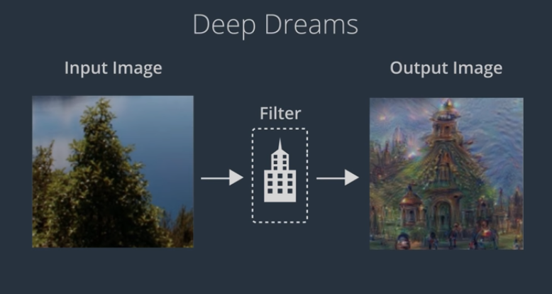
</p>

#### Visualizing CNNs (Part 2)
* based on [paper](https://arxiv.org/pdf/1311.2901) by Zeiler and Fergus, visualization using [this toolbox](https://www.youtube.com/watch?v=ghEmQSxT6tw).
  * Layer 1 - pick out very simple shapes and patterns like lines and blobs
  * Layer 2 - circle, stripes and rectangle
  * Layer 3 - complex combinations of features from the second layer
  * Layer 4 - continue progression
  * Layer 5 - classification

<p align="center">
  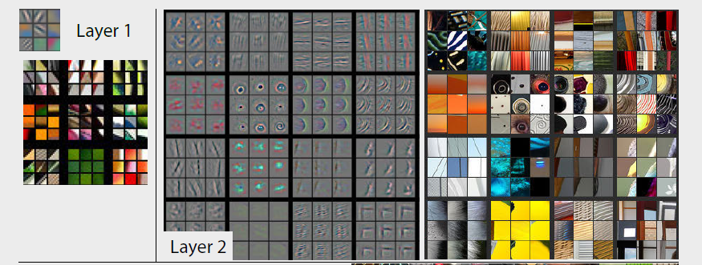
</p>

<p align="center">
  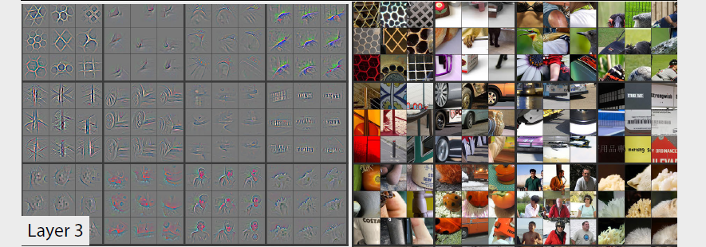
</p>

<p align="center">
  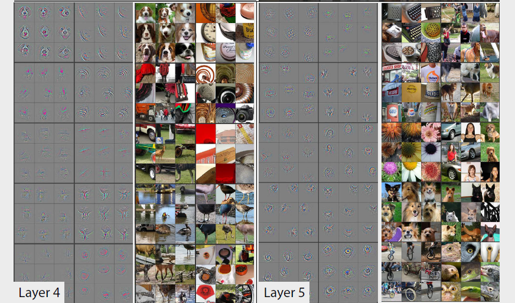
</p>

#### Summary of CNNs
* take input image then puts image through several convolutional and pooling layers
* result is a set of feature maps reduced in size from the original image
* flatten these maps, creating feature vector that can be passed to series of fully connected linear layer to produce probability distribution of class course
* from thes predicted class label can be extracted
* CNN not restricted to the image calssification task, can be applied to any task with a fixed number of outputs such as regression tasks that look at points on a face or detect human poses

### Quizes
#### Q1 - 5.5: How Computers Interpret Images
* Q: In the case of our 28x28 images, how many entries will the corresponding, image vector have when this matrix is flattened?
* A: `784`
* E: `28*28*1 values = 784`

#### Q2 - 5.6: MLP Structure & Class Scores
<p align="center">
  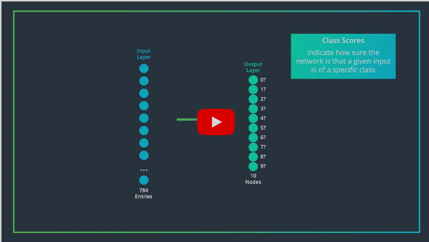
</p>

* Q: After looking at existing work, how many hidden layers will you use in your MLP for image classification?
* A: 2
* E: There is not one correct answer here, but one or two hidden layers should work fine for this simple task, and it's always good to do your research!

#### Q3 - 5.24: Kernels
<p align="center">
  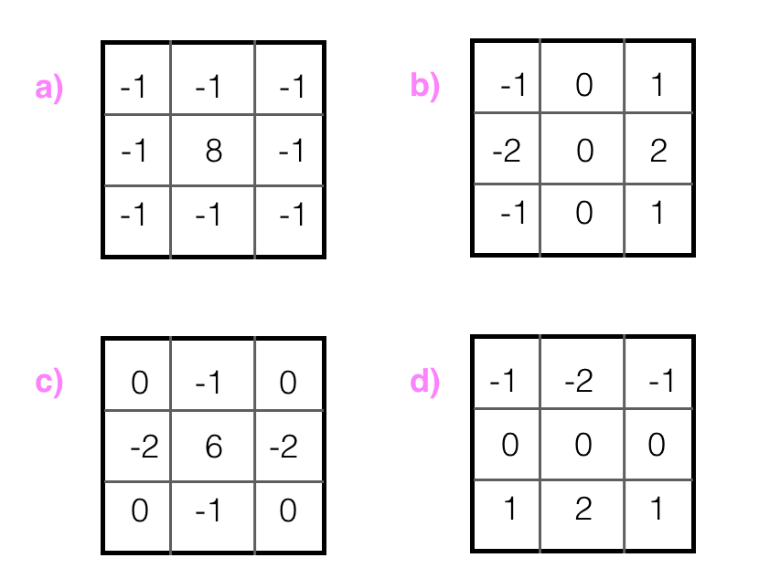
</p>

* Q: Of the four kernels pictured above, which would be best for finding and enhancing horizontal edges and lines in an image?
* A: `d`
* E: This kernel finds the difference between the top and bottom edges surrounding a given pixel.

#### Q4 - 5.32: CNN's for Image Classification
* Q: How might you define a Maxpooling layer, such that it down-samples an input by a factor of 4? 
* A: `nn.MaxPool2d(2,4)`, `nn.MaxPool2d(4,4)`
* E: The best choice would be to use a kernel and stride of 4, so that the maxpooling function sees every input pixel once, but any layer with a stride of 4 will down-sample an input by that factor.

#### Q5 - 5.33: Convolutional Layers in PyTorch

or the following quiz questions, consider an input image that is 130x130 (x, y) and 3 in depth (RGB). Say, this image goes through the following layers in order:

```
nn.Conv2d(3, 10, 3)
nn.MaxPool2d(4, 4)
nn.Conv2d(10, 20, 5, padding=2)
nn.MaxPool2d(2, 2)
```

* Q: After going through all four of these layers in sequence, what is the depth of the final output?
* A: `20`
* E: the final depth is determined by the last convolutional layer, which has a `depth` = `out_channels` = 20.


* Q: What is the x-y size of the output of the final maxpooling layer? Careful to look at how the 130x130 image passes through (and shrinks) as it moved through each convolutional and pooling layer.
* A: 16
* E: The 130x130 image shrinks by one after the first convolutional layer, then is down-sampled by 4 then 2 after each successive maxpooling layer!
  `((W_in - F + 2P) / S) + 1`

  ```
  ((130 - 3 + 2*0) / 1) + 1 = 128
  128 / 4 = 32
  ((32 - 5 + 2*2) / 1) + 1 = 32
  32 / 2 = 16
  ```


* Q: How many parameters, total, will be left after an image passes through all four of the above layers in sequence?
* A: `16*16*20`
* E: It's the x-y size of the final output times the number of final channels/depth = `16*16 * 20`.


### Notebooks
* [Multi-Layer Perceptron, MNIST](https://github.com/agungsantoso/deep-learning-v2-pytorch/blob/master/convolutional-neural-networks/mnist-mlp/mnist_mlp_exercise.ipynb)
* [Multi-Layer Perceptron, MNIST (With Validation)](https://colab.research.google.com/drive/1u4FmtGa24clNIp3sdltqRxyaEHEi-fGe)
* [Creating a Filter, Edge Detection](https://github.com/agungsantoso/deep-learning-v2-pytorch/blob/master/convolutional-neural-networks/conv-visualization/custom_filters.ipynb)
* [Convolutional Layer](https://github.com/agungsantoso/deep-learning-v2-pytorch/blob/master/convolutional-neural-networks/conv-visualization/conv_visualization.ipynb)
* [Maxpooling Layer](https://github.com/agungsantoso/deep-learning-v2-pytorch/blob/master/convolutional-neural-networks/conv-visualization/maxpooling_visualization.ipynb)
* [Convolutional Neural Networks](https://github.com/agungsantoso/deep-learning-v2-pytorch/blob/master/convolutional-neural-networks/cifar-cnn/cifar10_cnn_exercise.ipynb)
* [Convolutional Neural Networks - Image Augmentation](https://github.com/agungsantoso/deep-learning-v2-pytorch/blob/master/convolutional-neural-networks/cifar-cnn/cifar10_cnn_augmentation.ipynb)

## Lesson 6: Style Transfer
### Lectures

#### Style Transfer
* apply the style of one image to another image

<p align="center">
  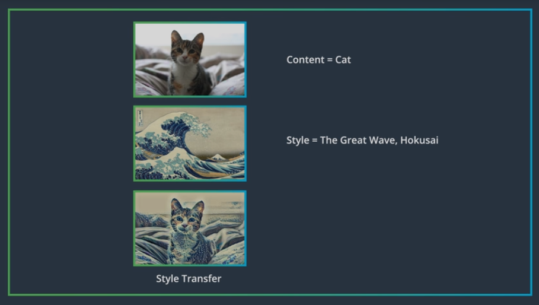
</p>

#### Separating Style & Content
* feature space designed to capture texture and color information used, essentially looks at spatial correlations within a layer of a network
* correlation is a measure of the relationship between two or more variables

<p align="center">
  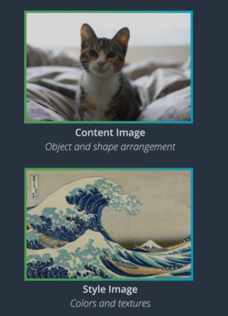
</p>

* similarities and differences between features in a layer should give some information about texture and color information found in an image, but at the same time leave out information about the actual arrangement and identitity of different objects in that image

<p align="center">
  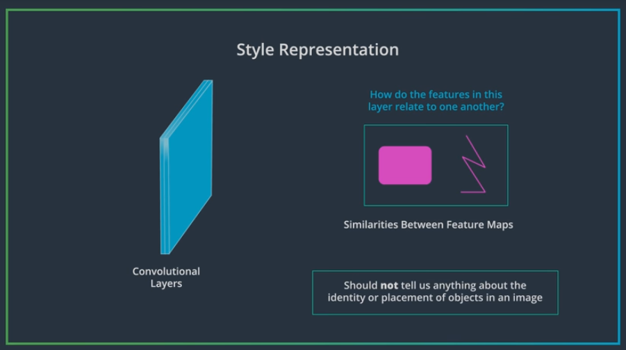
</p>

#### VGG19 & Content Loss
* VGG19 -> 19 layer VGG network

<p align="center">
  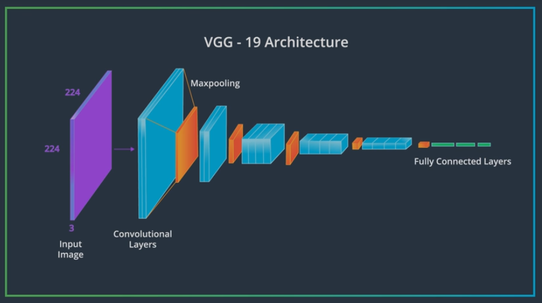
</p>

* When the network sees the __content image__, it will go through feed-forward process until it gets to a conv layer that is deep in the network, the output will be the content representation

<p align="center">
  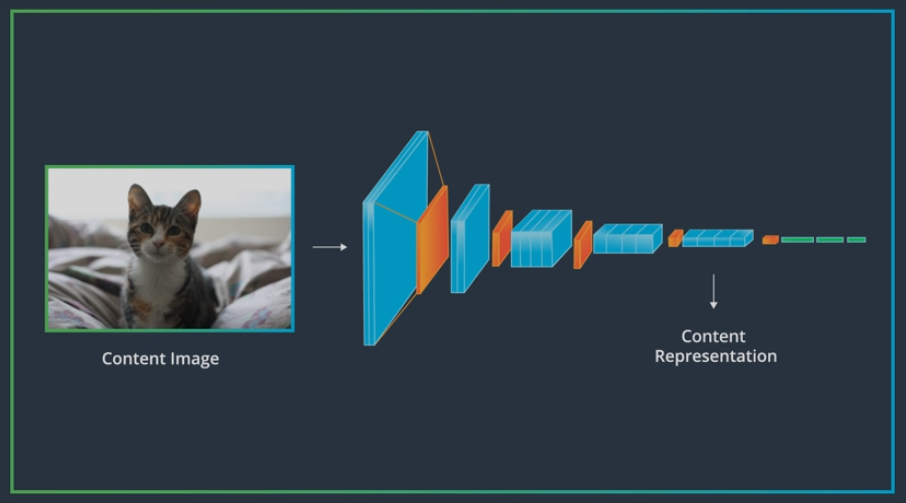
</p>

* When it sees tye __style image__, it will extract different features from multiple layers that represent the style of that image

<p align="center">
  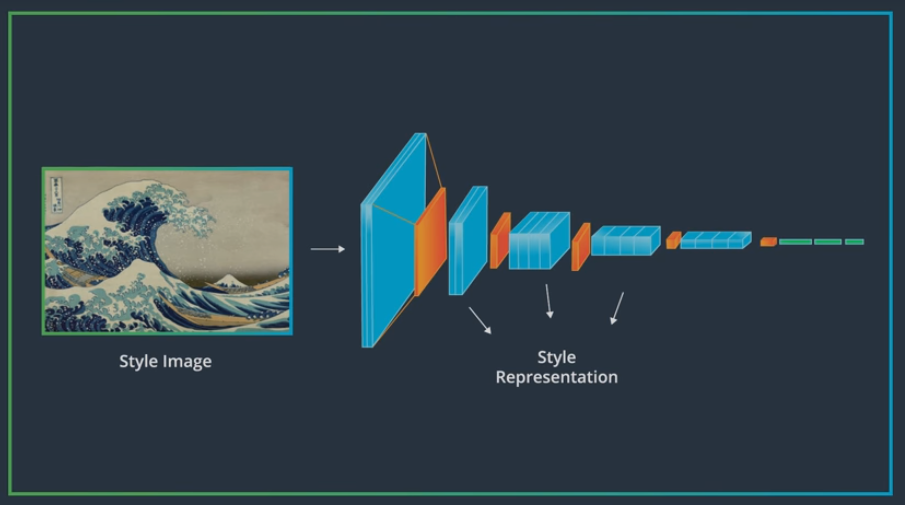
</p>

* __content loss__ is a loss that calculates the difference between the content (Cc) and target (Tc) image representation

<p align="center">
  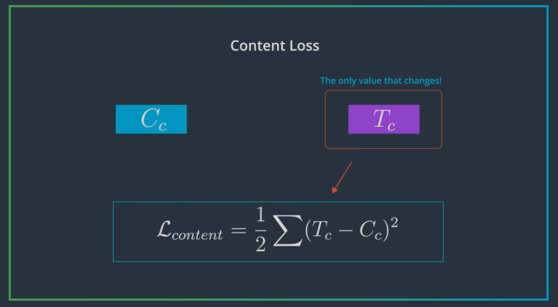
</p>

#### Gram Matrix
* Correlations at each layer in convolutional layer are given by a Gram matrix
* First step in calculating the Gram matrix, will be to vectorize the values of feature map

<p align="center">
  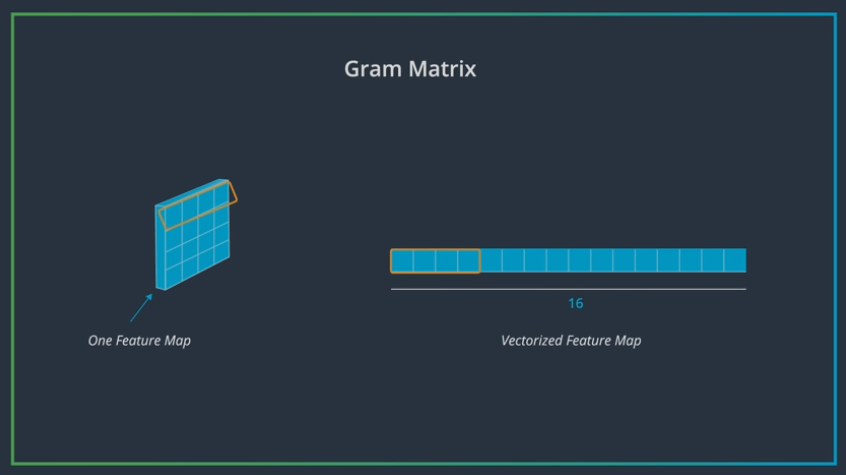
</p>

* By flattening the XY dimensions of the feature maps, we're convrting a 3D conv layer to a 2D matrix of values

<p align="center">
  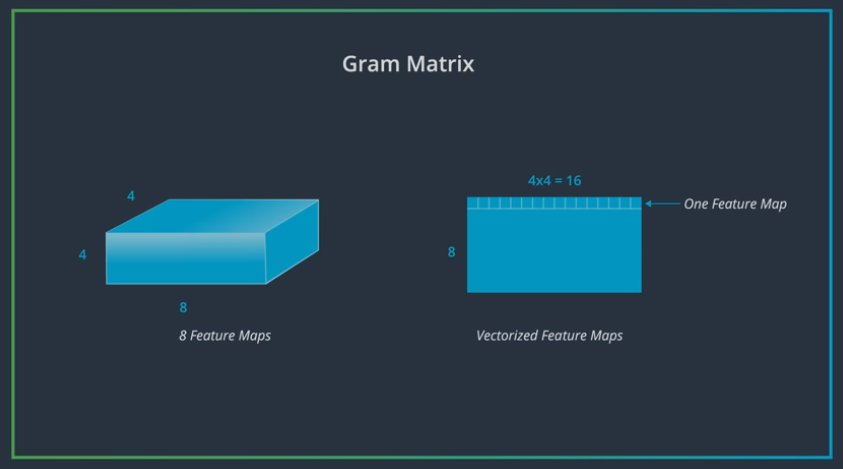
</p>

* The next step is to multiply vectorized feature map by its transpose to get the gram matrix

<p align="center">
  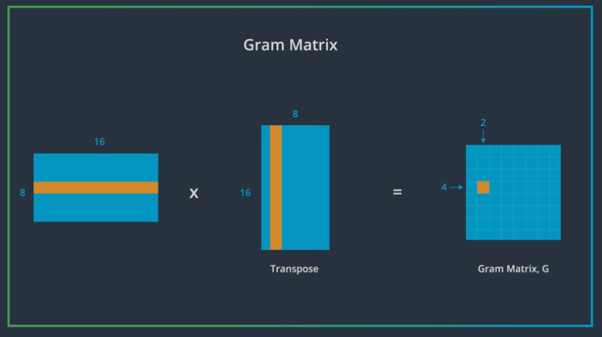
</p>

#### Style Loss

* __content loss__ is a loss that calculates the difference between the image style (Ss) and target (Ts) image style, `a` is constant that accounts for the number of values in each layer, `w` is style weights

<p align="center">
  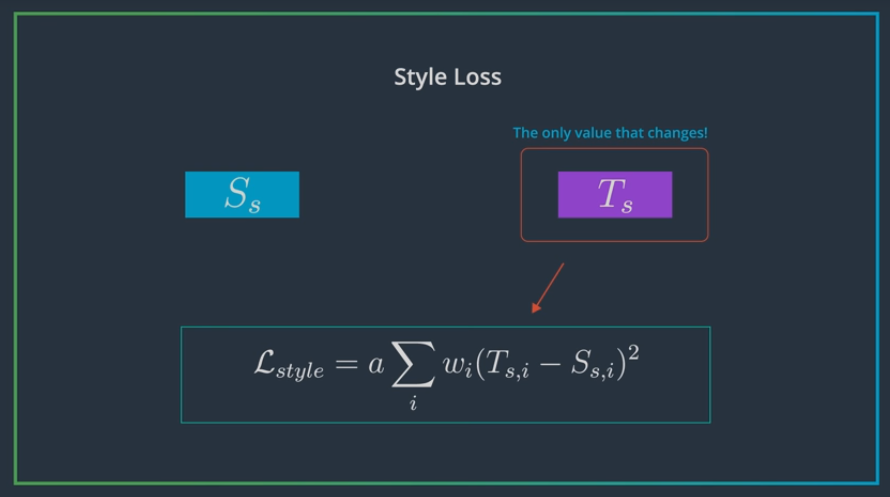
</p>

* Add together content loss and style loss to get total loss and then use typical back propagation and optimization to reduce total loss

<p align="center">
  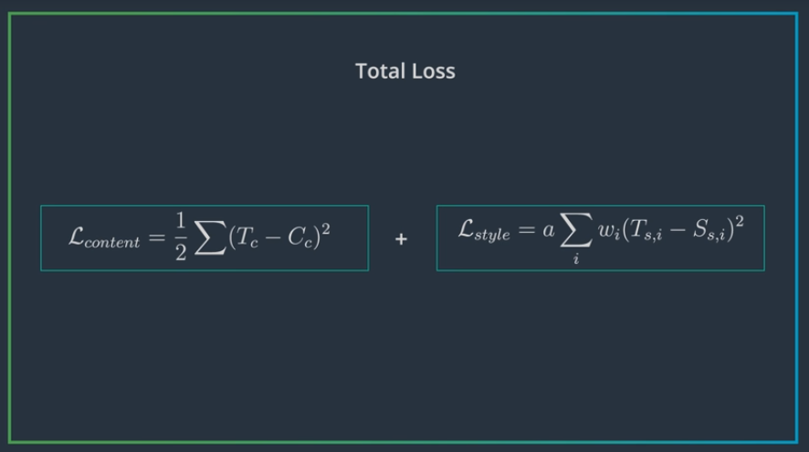
</p>

#### Loss Weights

* alpha beta ratio is ratio between alpha (content weight) and beta (style weight)

<p align="center">
  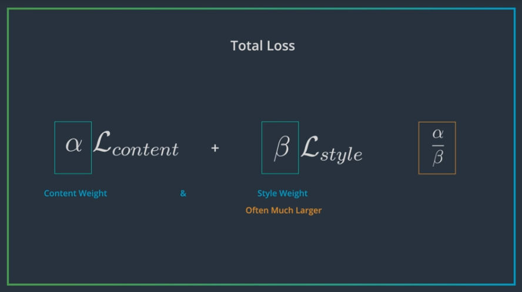
</p>

* Different alpha beta ratio can result in different generated image

<p align="center">
  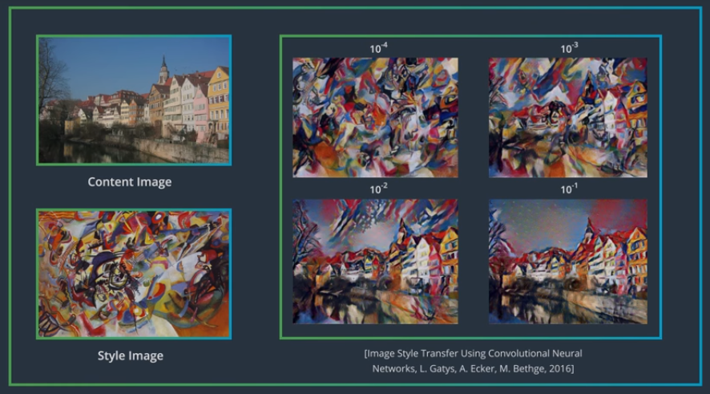
</p>

### Quizes
#### Q1 - 6.4: Gram Matrix
##### Q 1.1
* Q: Given a convolutional layer with dimensions `d x h x w = (20*8*8)`, what length will one row of the vectorized convolutional layer have? (Vectorized means that the spatial dimensions are flattened.)
* A: `64`
* E: When the height and width (8 x 8) are flattened, the resultant 2D matrix will have as many columns as the height and width, multiplied: `8*8 = 64`.

##### Q 1.2
* Q: Given a convolutional layer with dimensions `d x h x w = (20*8*8)`, what dimensions (h x w) will the resultant Gram matrix have?
* A: `(20 x 20)`
* E: The Gram matrix will be a square matrix, with a width and height = to the depth of the convolutional layer in question.

### Notebooks
* [Style Transfer with Deep Neural Networks](https://github.com/agungsantoso/deep-learning-v2-pytorch/blob/master/style-transfer/Style_Transfer_Exercise.ipynb)


## Lesson 7: Recurrent Neural Networks

### Lectures
#### Intro to RNNs
* RNN (__R__ ecurrent __N__ eural __N__ etworks)

  A neural network that is intentionally run multiple times, where parts of each run feed into the next run. Specifically, hidden layers from the previous run provide part of the input to the same hidden layer in the next run. Recurrent neural networks are particularly useful for evaluating sequences, so that the hidden layers can learn from previous runs of the neural network on earlier parts of the sequence.

  For example, the following figure shows a recurrent neural network that runs four times. Notice that the values learned in the hidden layers from the first run become part of the input to the same hidden layers in the second run. Similarly, the values learned in the hidden layer on the second run become part of the input to the same hidden layer in the third run. In this way, the recurrent neural network gradually trains and predicts the meaning of the entire sequence rather than just the meaning of individual words.

  <p align="center">
    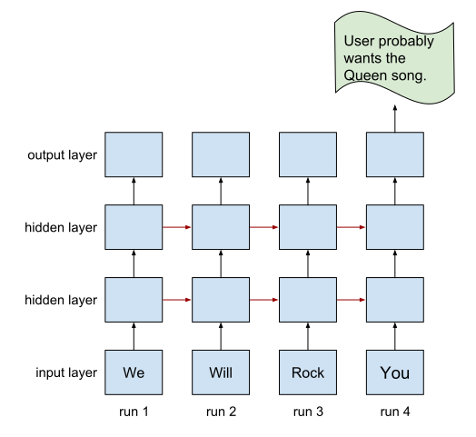
  </p>

* LSTM (__L__ ong __S__ hort - __T__ erm __M__ emory)

  LSTM are an improvement of the RNN, and quite useful when needs to switch between remembering recent things, and things from long time ago

#### RNN vs LSTM
* RNN work as follows:
  * memory comes in an merges with a current event
  * and the output comes out as a prediction of what the input is
  * as part of the input for the next iteration of the neural network
* RNN has problem with the memory that is short term memory

<p align="center">
  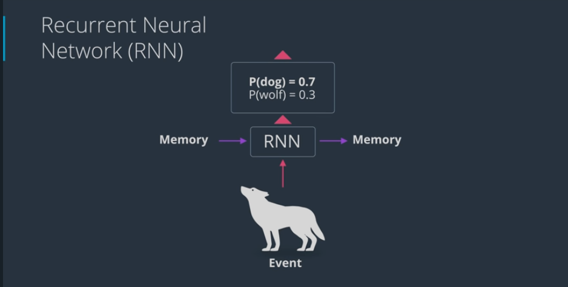
</p>

* LSTM works as follows:
  * keeps track long term memory which comes in an comes out
  * and short term memory which also comes in and comes out
* From there, we get a new long term memory, short term memory and a prediction. In here, we protect old information more.

<p align="center">
  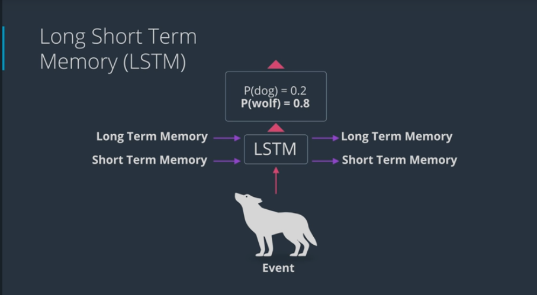
</p>

#### Basics of LSTM
* Architecture of LSTM
  * forget gate

    long term memory (__LTM__) goes here where it forgets everything that it doesn't consider useful
  * learn gate

    short term memory and event are joined together containing information that have recently learned and it removes any unecessary information
  * remember gate

    long term memory that haven't forgotten yet plus the new information that have learned get joined together to update long term memmory
  * use gate
  
    decide what information use from what previously know plus what we just learned to make a prediction. The output becomes both the prediction and the new short term memory (__STM__)

  <p align="center">
    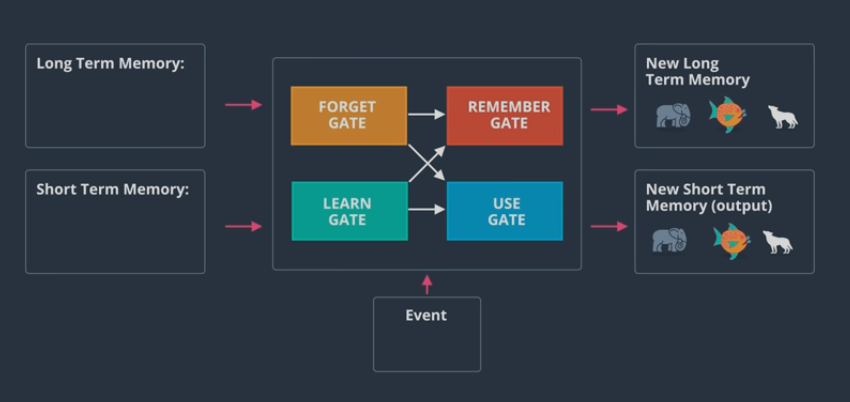
  </p>

  <p align="center">
    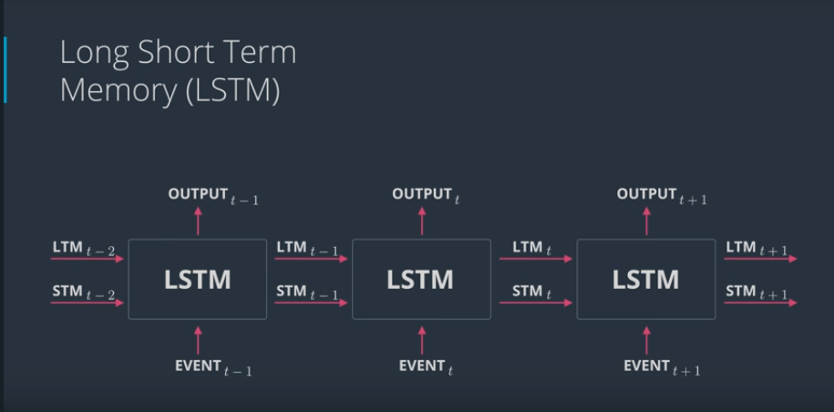
  </p>

#### Architecture of LSTM
* RNN Architecture

<p align="center">
  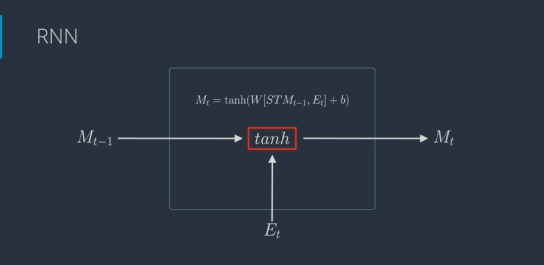
</p>

* LSTM Architecture

<p align="center">
  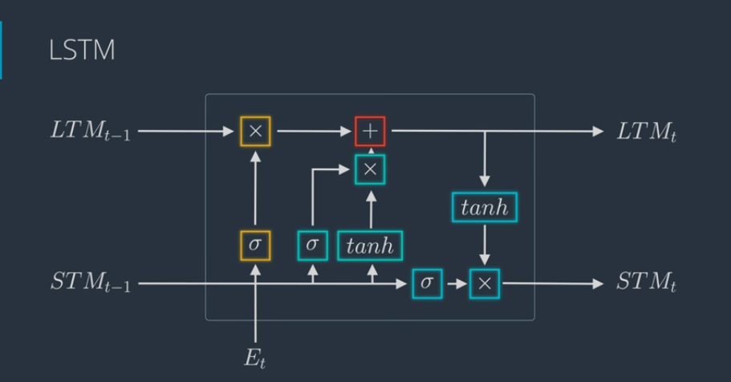
</p>

#### The Learn Gate

* Learn gate works as follows:
  * Take __STM__ and the __event__ and jonis it (use __tanh__ activation function)
  * then ignore (ignore factor) a bit to keep the important part of it (use __sigmoid__ activation function)

<p align="center">
  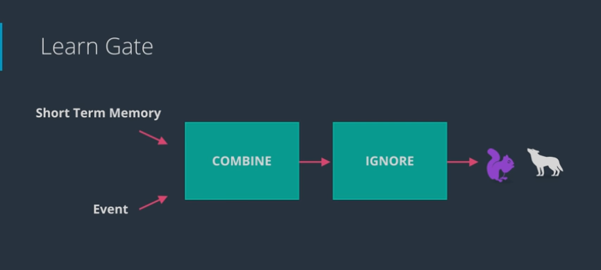
</p>

<p align="center">
  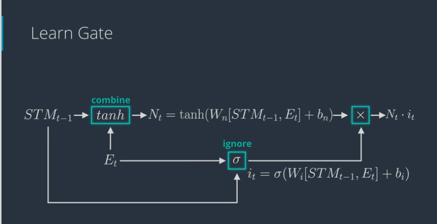
</p>

<p align="center">
  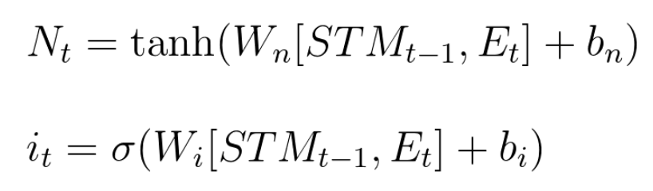
</p>

#### The Forget Gate

* Forget gate works as follows:
  * Take __LTM__ and decides what parts to keep and to forget (forget factor, use __sigmoid__ activation function)

<p align="center">
  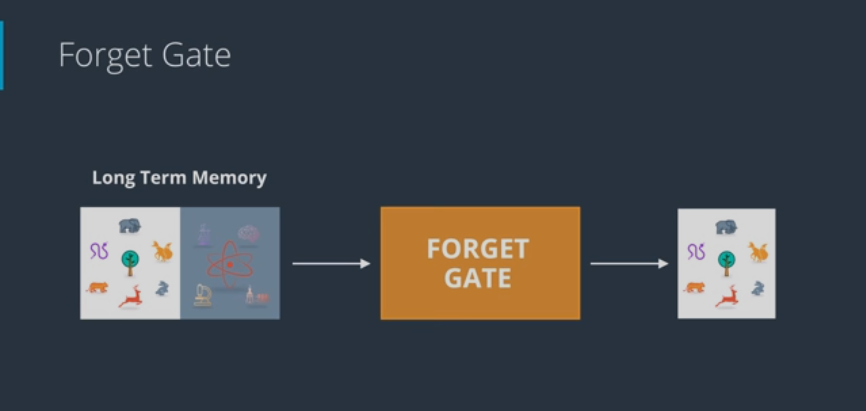
</p>

<p align="center">
  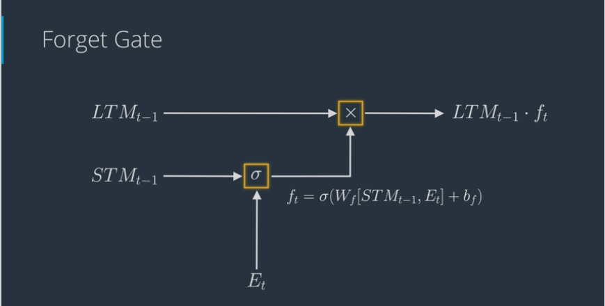
</p>

<p align="center">
  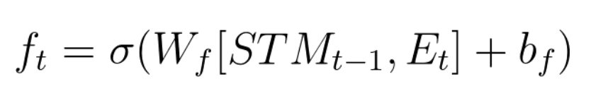
</p>

#### The Remember Gate

* Remember gate works as follows:
  * Take LTM coming out of forget gate and STM coming out of learn gate and combine them together

<p align="center">
  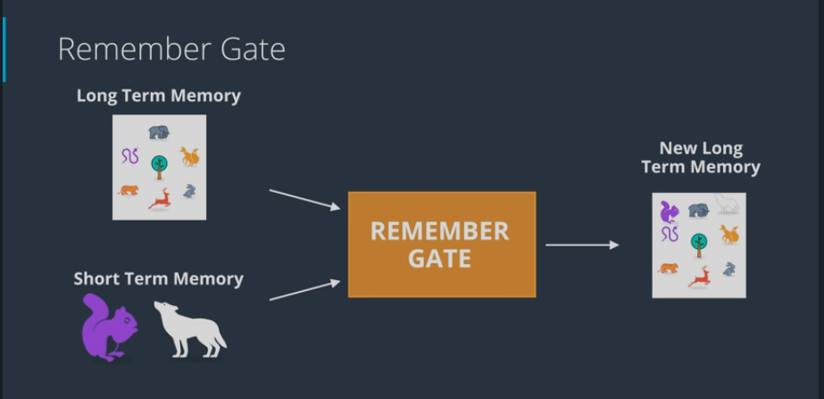
</p>

<p align="center">
  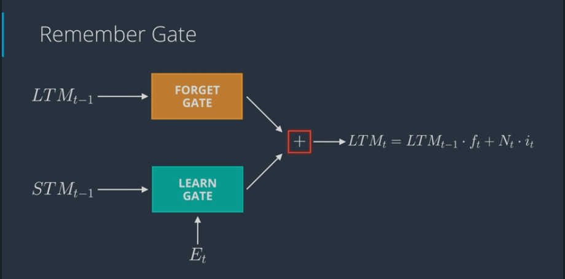
</p>

<p align="center">
  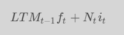
</p>

#### The Use Gate

* Remember gate works as follows:
  * Take LTM coming out of forget gate (apply __tanh__) and STM coming out of learn gate (apply __sigmoid__) to come up with a new STM and an output (multiply them together)

<p align="center">
  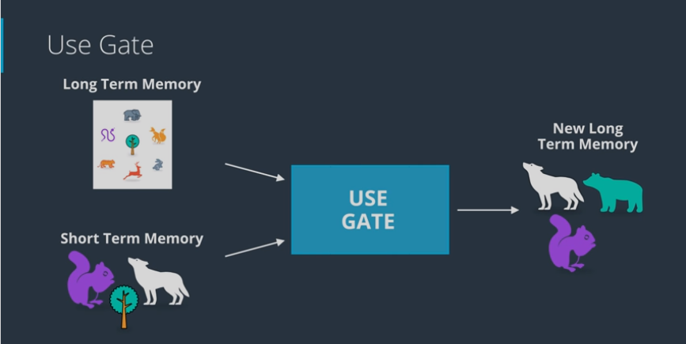
</p>

<p align="center">
  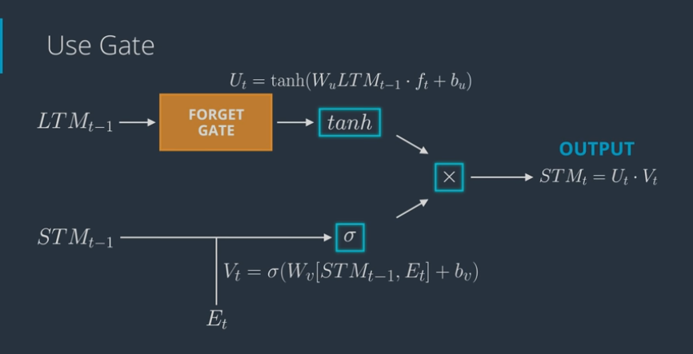
</p>

<p align="center">
  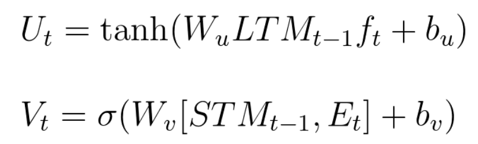
</p>

#### Putting it All Together

<p align="center">
  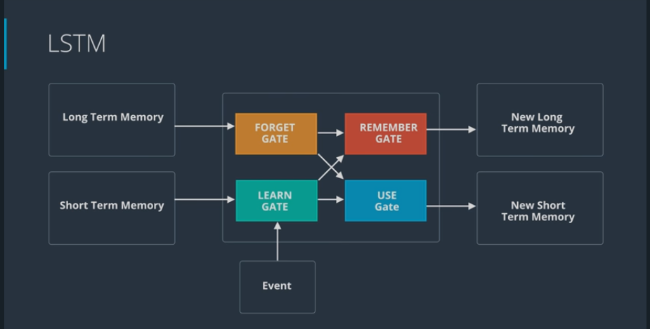
</p>

<p align="center">
  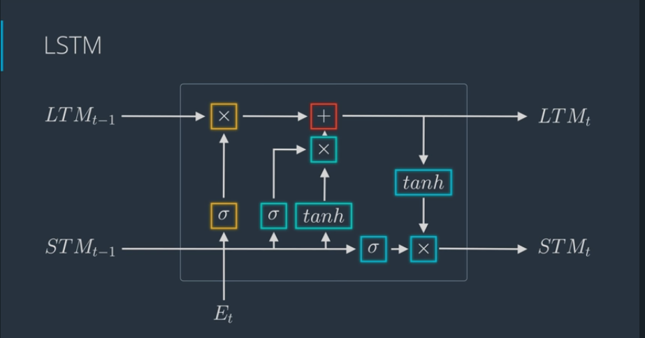
</p>

#### Other architectures

#### Implementing RNNs

#### Time-Series Prediction

#### Training & Memory

#### Character-wise RNNs

#### Sequence Batching

#### Notebook: Character-Level RNN

#### Implementing a Char-RNN

#### Batching Data, Solution

#### Defining the Model

#### Char-RNN, Solution

#### Making Predictions

### Quizes

### Notebooks


## Lesson 8

## Lesson 9

## Challenge Project

## Credits
1. Images taken from lectures videos at [Intro to Deep Learning with PyTorch](https://www.udacity.com/course/deep-learning-pytorch--ud188)
2. [Machine Learning Glossary](https://developers.google.com/machine-learning/glossary/)